阅读xv6 book第一章

#  课程内容简介

大家好，欢迎来到6.S081 --- 操作系统这门课程。我的名字叫Robert，我会与Frans一起讲这门课。David，Nicholas会作为这门课程的助教。在我们在线授课的过程中，请尽情提问。你可以直接语音打断我，或者通过聊天窗口提问，我们工作人员会关注聊天窗口。顺便说一下，我们也会通过视频录制这门课程，之后我们会通过网络发布视频，这样方便你复习，对于没能参加课程的同学也可以通过视频观看。

接下来我想从列出这门课程的目标来开始。这门课程的目标有：

1.理解操作系统的设计和实现。设计是指整体的结构，实现是指具体的代码长什么样。对于这两者，我们都会花费大量时间讲解。

2.为了深入了解具体的工作原理，你们可以通过一个小的叫做XV6的操作系统，获得实际动手经验。通过研究现有的操作系统，并结合课程配套的实验，你可以获得扩展操作系统，修改并提升操作系统的相关经验，并且能够通过操作系统接口，编写系统软件。

所以，这些就是你将要在课程中完成的内容。

我们同时也对操作系统本身的目标感兴趣。对于操作系统的目标，我也列出了几个点。你知道的，市面上有大量不同的操作系统，通常来说，他们都有一些共同的目标。

1.第一个就是**抽象硬件**。通常来说，你会买一个计算机，里面包含了CPU，内存，但是这是一种非常低层级的资源。幸好我们有一些应用程序实现了高层级的接口和抽象，例如进程，文件系统。这些高层级的接口和抽象（Abstraction）方便了应用的开发，也提供了更好的移植性。

2.操作系统的另一个重要的任务是：在**多个应用程序之间共用硬件资源**。你可以在一个操作系统同时运行文本编辑器，程序编译器，多个数据库等等。操作系统能非常神奇的在不相互干扰的前提下，同时运行这些程序。这里通常被称为multiplex。

3.因为在操作系统中可能同时运行很多程序，即使程序出现了故障，多个程序之间互不干扰就变得非常重要。所以这里需要**隔离性**（Isolation），不同的活动之间不能相互干扰。

4.但是另一方便，不同的活动之间有时又想要相互影响，比如说数据交互，协同完成任务等。举个例子，我通过文本编辑器创建了一个文件，并且我希望我的编译器能读取文件，我绝对想要**数据能共享**。所以，我们希望能在需要的时候实现共享（Sharing）。

5.但是在很多场景下，用户并不想要共享，比如你登录到了一个公共的计算机，例如Athena，你不会想要其他人来读取你的文件。所以在共享的同时，我们也希望在没有必要的时候不共享。这里我们称为**Security**或者Permission System或者是Access Control System。

6.另一个人们认为操作系统应该具有的价值是：如果你在硬件上花费了大量的金钱，你会期望你的应用程序拥有硬件应该提供的完整性能，但是很多时候你只负责应用程序编程，你会期望操作系统也必须保证自身提供的服务不会阻止应用程序获得高性能。所以操作系统需要至少不阻止应用程序获得高性能，甚至需要帮助应用程序获得**高性能（Performance）**。

7.最后，对于大部分操作系统，必须要支持大量不同类型的应用程序，或许这是一个笔记本，正在运行文本编辑器，正在运行游戏，或许你的操作系统需要支持数据库服务器和云计算。通常来说，设计并构造一个操作系统代价是非常大的，所以人们总是希望在相同的操作系统上，例如Linux，运行大量的任务。我认为大部分人都已经跑过Linux，并使用了我刚刚描述的所有的场景。所以，**同一个操作系统需要能够支持大量不同的用户场景**。

# 操作系统结构

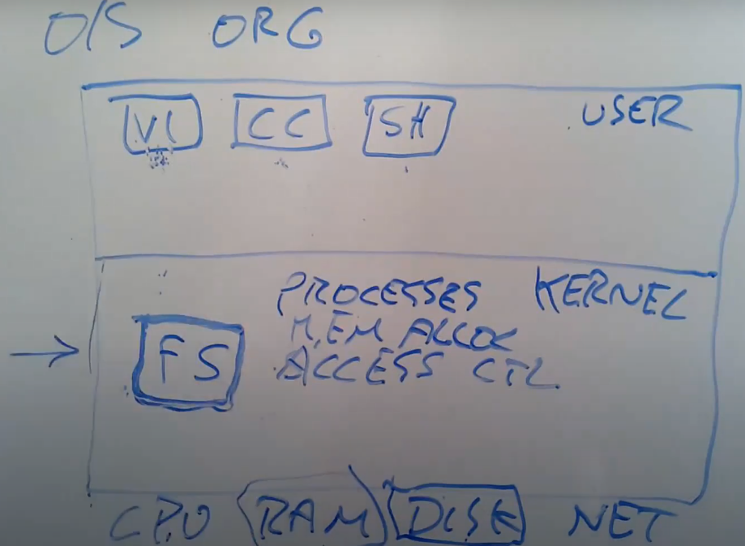

最下一层是计算机硬件资源，硬件资源包括了CPU，内存，磁盘，网卡。

最上层是用户空间，运行一些用户程序，或许有一个文本编辑器（VI），或许有一个C编译器（CC），以及作为CLI（command-line interface）存在的Shell

区别于用户空间程序，有一个特殊的程序总是会在运行，它称为Kernel。Kernel是计算机资源的守护者。当你打开计算机时，Kernel总是第一个被启动。Kernel程序只有一个，它维护数据来管理每一个用户空间进程。Kernel同时还维护了大量的数据结构来帮助它管理各种各样的硬件资源，以供用户空间的程序使用。Kernel同时还有大量内置的服务，例如，Kernel通常会有文件系统实现类似文件名，文件内容，目录的东西，并理解如何将文件存储在磁盘中。所以用户空间的程序会与Kernel中的文件系统交互，文件系统再与磁盘交互。

在这门课程中，我们主要关注点在**Kernel、连接Kernal和用户空间程序的接口、Kernel内软件的架构**。所以，我们会关心Kernel中的服务，其中一个服务是文件系统，另一个就是进程管理系统。每一个用户空间程序都被称为一个进程，它们有自己的内存和共享的CPU时间。同时，Kernel会管理内存的分配。不同的进程需要不同数量的内存，Kernel会复用内存、划分内存，并为所有的进程分配内存。

文件系统通常有一些逻辑分区。目前而言，我们可以认为文件系统的作用是管理文件内容并找出文件具体在磁盘中的哪个位置。文件系统还维护了一个独立的命名空间，其中每个文件都有文件名，并且命名空间中有一个层级的目录，每个目录包含了一些文件。所有这些都被文件系统所管理。

这里还有一些安全的考虑，我们可以称之为**Access Control**。当一个进程想要使用某些资源时，比如读取磁盘中的数据，使用某些内存，Kernel中的Access Control机制会决定是否允许这样的操作。对于一个分时共享的计算机，例如Athena系统，这里可能会变得很复杂。因为在Athena系统中，每一个进程可能属于不同的用户，因此会有不同Access规则来约定哪些资源可以被访问。

在一个真实的完备的操作系统中，会有很多很多其他的服务，比如在不同进程之间通信的进程间通信服务，比如一大票与网络关联的软件（TCP/IP协议栈），比如支持声卡的软件，比如支持数百种不同磁盘，不同网卡的驱动。所以在一个完备的系统中，Kernel会包含大量的内容，数百万行代码。


**应用程序如何与kernel交互**

我们同时也对应用程序是如何与Kernel交互，它们之间的接口长什么样感兴趣。这里通常成为Kernel的API，它决定了**应用程序如何访问Kernel**。通常来说，这里是通过所谓的**系统调用（System Call）**来完成。系统调用与程序中的函数调用看起来是一样的，但**区别是系统调用会实际运行到系统内核中，并执行内核中对于系统调用的实现**。在这门课程的后面，我会详细介绍系统调用。现在，我只会介绍一些系统调用在应用程序中是长什么样的。

1.open与write：
第一个例子是，如果应用程序需要打开一个文件，它会调用名为open的系统调用，并且把文件名作为参数传给open。假设现在要打开一个名为“out”的文件，那么会将文件名“out”作为参数传入。同时我们还希望写入数据，那么还会有一个额外的参数，在这里这个参数的值是1，表明我想要写文件。

```c++
fd = open("out", 1);
```

这里看起来像是个函数调用，但是open是一个系统调用，它会跳到Kernel，Kernel可以获取到open的参数，执行一些实现了open的Kernel代码，或许会与磁盘有一些交互，最后返回一个**文件描述符对象**。上图中的fd全称就是**file descriptor**。之后，应用程序可以使用这个文件描述符作为handle，来表示相应打开的文件。

如果你想要向文件写入数据，相应的系统调用是write。你需要向write传递一个由open返回的文件描述符作为参数。你还需要向write传递一个指向要写入数据的指针（数据通常是char型序列），在C语言中，可以简单传递一个双引号表示的字符串（下图中的\n表示是换行）。第三个参数是你想要写入字符的数量。

```c++
wirte(fd, "hello\n", 6);
```

第二个参数的指针，实际上是内存中的地址。所以这里实际上告诉内核，将内存中这个地址起始的6个字节数据写入到fd对应的文件中。

2.fork:
另一个你可能会用到的，更有意思的系统调用是fork。fork是一个这样的系统调用，它创建了一个与调用进程一模一样的新的进程，并返回新进程的process ID/pid。这里实际上会复杂的多，我们后面会有更多的介绍。

```c++
pid = fork();
```

# Why Hard and Interesting

我还想说一下为什么我认为学习操作系统是挑战和乐趣并存的？以及为什么我们需要专门针对操作系统设置一门课程？

学习操作系统比较难的一个原因是，**内核的编程环境比较困难**。当你在编写、修改，扩展内核，或者写一个新的操作系统内核时，你实际上在提供一个基础设施让别人来运行他们的程序。当程序员在写普通的应用程序时，应用程序下面都是操作系统。而当我们在构建操作系统时，在操作系统下面就是硬件了，这些硬件通常会更难处理。在这门课程中，我们会使用一个叫做**QEMU的硬件模拟器，来模拟CPU和计算机。**这会简单一些，但即使这样，编程环境还是比较恶劣。

学习操作系统比较难的另一个原因是，当你在设计一个操作系统时，你需要满足一些列矛盾的需求。

- 其中一个是，你想要你的操作系统既高效又易用。高效通常意味着操作系统需要在离硬件近的low-level进行操作，而易用则要求操作系统为应用程序提供抽象的high-level可移植接口。所以，提供一个**简单可移植，同时又高效的抽象接口**需要一定的技巧。
- 另一个矛盾的点是，我们想要提供一个非常强大的操作系统服务，这样操作系统才能分担运行应用程序的负担，所以我们需要强大的操作系统服务。但同时，我们也想要有简单的接口。我们不想程序员看到数量巨多，复杂且难以理解的的内核接口。因为，如果他们不理解这些接口，他们就会很难使用这些接口。所以，我们也想要简单的API。实际上是有可能提供**既简单，同时又包含强大功能**的接口。所以，这里要提供一个简单的接口，同时又包含了强大的功能。
- 最后一个矛盾点是所有的操作系统需要满足的。你希望给与应用程序尽可能多的**灵活性**，你不会想要限制应用程序，所以你需要内核具备灵活的接口。但是另一方面，你的确需要在某种程度上限制应用程序，因为你会想要安全性。我们希望给程序员完全的自由，但是实际上又不能是真正的完全自由，因为我们不想要程序员能直接访问到硬件，干扰到其他的应用程序，或者干扰操作系统的行为。

另一件使得操作系统的设计难且有趣的点是：操作系统提供了大量的特性和大量的服务，但是它们趋向于相互交互。有时，这种交互以奇怪的方式进行，并且需要你大量的思考。即使在我之前给出的一个简单例子中，对于open和fork，它们之间也可能有交互。如果一个应用程序通过open系统调用得到了一个文件描述符fd。之后这个应用程序调用了fork系统调用。fork的语义是创建一个当前进程的拷贝进程。**而对于一个真正的拷贝进程，父进程中的文件描述符也必须存在且可用**。所以在这里，一个通过open获得的文件描述符，与fork以这种有趣的方式进行交互。当然，你需要想明白，子进程是否能够访问到在fork之前创建的文件描述符fd。在我们要研究的操作系统中答案是，Yes，需要能够访问。

另一件有趣的事情，我之前也提到过，操作系统需要能够满足广泛的使用场景。相同的操作系统需要既给数据库服务器使用，又给智能手机使用。随着时间的推移，你的计算机所使用的硬件也在变化，或许你有了超级快的SSD存储而不是机械的硬盘。大概15年前，多核CPU计算机还极其稀有，而现在变得极其的流行。最近，我们又看到了网速以指数级增长。所有的这些都需要时不时的重新思考，操作系统是如何被设计的。

前面理性的分析了一下为什么你要学习这门课程。同时，这里也有一些更加实际的原因来告诉你为什么会选择这门课程。

- 其中一个原因是，如果你对于计算机的运行原理感兴趣，对于你打开计算机以后实际发生的事情感兴趣，那么这门课程你就选对了。
- 类似的，如果你喜欢基础架构，比如你喜欢构建一些其他程序可以使用的服务，那么这门课程都是有关基础架构的内容，因为操作系统就是基础架构。
- 如果你曾经花费了大量的时间来定位应用程序的Bug，或者定位安全的问题，那么你会发现这些经历通常需要理解操作系统是如何运作的。比如从根本上来说，操作系统涉及了很多安全相关的策略。当程序运行出错时，操作系统需要来收拾残局，而这一步也通常包括在定位问题中。

# 课程结构和资源（略）

# read, write, exit系统调用

接下来，我将讨论对于应用程序来说，**系统调用长成什么样**。因为系统调用是操作系统提供的服务的接口，所以系统调用长什么样，应用程序期望从系统调用得到什么返回，系统调用是怎么工作的，这些还是挺重要的。你会在第一个lab中使用我们在这里介绍的系统调用，并且在后续的lab中，**扩展并提升这些系统调用的内部实现**。

我接下来会展示一些简单的例子，这些例子中会执行系统调用，并且我会在XV6中运行这些例子。**XV6是一个简化的类似Unix的操作系统**，而Unix是一个老的操作系统，但是同时也是很多现代操作系统的基础，例如Linux，OSX。所以Unix使用的非常广泛。而作为我们教学用的操作系统，XV6就要简单的多。它是受Unix启发创造的，有着相同的文件结构，但是却要比任何真实的Unix操作系统都要简单的多。因为它足够简单，所以你们极有可能在几周内很直观的读完所有的代码，同时也把相应的书也看完，这样你们就能理解XV6内部发生的一切事情了。

**XV6运行在一个RISC-V微处理器上**，而RISC-V是MIT6.004课程讲解的处理器，所以你们很多人可能已经知道了RISC-V指令集。理论上，你可以在一个RISC-V计算机上运行XV6，已经有人这么做了。但是我们会在一个QEMU模拟器上运行XV6。

我这里会写下来，我们的操作系统是XV6，它运行在RISC-V微处理器上，当然不只是RISC-V微处理器，我们假设有一定数量的其他硬件存在，例如内存，磁盘和一个console接口，这样我们才能跟操作系统进行交互。但是实际上，XV6运行在QEMU模拟器之上。这样你们都能在没有特定硬件的前提下，运行XV6。

我向你们展示的第一个系统调用是一个叫做copy的程序。

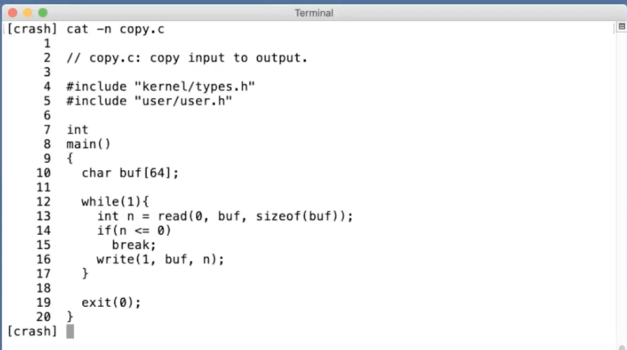

如果你看第13行的read，它接收3个参数：

- 第一个参数是文件描述符，指向一个之前打开的文件。Shell会确保默认情况下，当一个程序启动时，文件描述符0连接到console的输入，文件描述符1连接到了console的输出。所以我可以通过这个程序看到console打印我的输入。当然，这里的程序会预期文件描述符已经被Shell打开并设置好。这里的0，1文件描述符是非常普遍的Unix风格，许多的Unix系统都会从文件描述符0读取数据，然后向文件描述符1写入数据。
- read的第二个参数是指向某段内存的指针，程序可以通过指针对应的地址读取内存中的数据，这里的指针就是代码中的buf参数。在代码第10行，程序在栈里面申请了64字节的内存，并将指针保存在buf中，这样read可以将数据保存在这64字节中。
- read的第三个参数是代码想读取的最大长度，sizeof(buf)表示，最多读取64字节的数据，所以这里的read最多只能从连接到文件描述符0的设备，也就是console中，读取64字节的数据。

read的返回值可能是读到的字节数，在上面的截图中也就是6（xyzzy加上结束符）。read可能从一个文件读数据，如果到达了文件的结尾没有更多的内容了，read会返回0。如果出现了一些错误，比如文件描述符不存在，read或许会返回-1。在后面的很多例子中，比如第16行，我都没有通过检查系统调用的返回来判断系统调用是否出错，但是你应该比我更加小心，你应该清楚系统调用通常是通过返回-1来表示错误，你应该检查所有系统调用的返回值以确保没有错误。

如果你想知道所有的系统调用的参数和返回值是什么，在XV6书籍的第二章有一个表格。

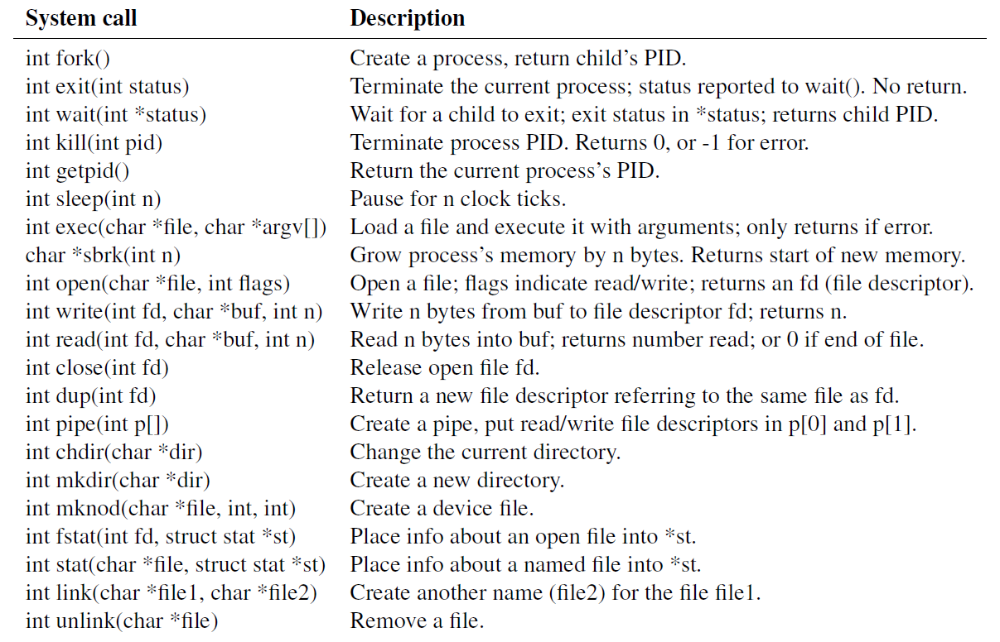

有一件事情需要注意的事，这里的copy程序，或者说read，write系统调用，它们并不关心读写的数据格式，它们就是单纯的读写，而copy程序会按照8bit的字节流处理数据，你怎么解析它们，完全是用应用程序决定的。所以应用程序可能会解析这里的数据为C语言程序，但是操作系统只会认为这里的数据是按照8bit的字节流。

# open系统调用

前面，copy代码假设文件描述符已经设置好了。但是一般情况下，我们需要能创建文件描述符，最直接的创建文件描述符的方法是open系统调用。下面是一个叫做open的源代码，它使用了open系统调用。

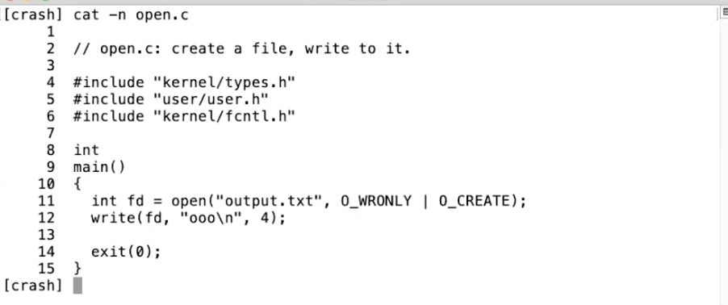

代码中的第11行，执行了open系统调用，将文件名output.txt作为参数传入，第二个参数是一些标志位，用来告诉open系统调用在内核中的实现：我们将要创建并写入一个文件。open系统调用会返回一个新分配的文件描述符，这里的文件描述符是一个小的数字，可能是2，3，4或者其他的数字。

之后，这个文件描述符作为第一个参数被传到了write，write的第二个参数是数据的指针，第三个参数是要写入的字节数。数据被写入到了文件描述符对应的文件中。

文件描述符本质上对应了内核中的一个表单数据。内核维护了每个运行进程的状态，内核会为每一个运行进程保存一个表单，表单的key是文件描述符。这个表单让内核知道，每个文件描述符对应的实际内容是什么。这里比较关键的点是，每个进程都有自己独立的文件描述符空间，所以如果运行了两个不同的程序，对应两个不同的进程，如果它们都打开一个文件，它们或许可以得到相同数字的文件描述符，但是因为内核为每个进程都维护了一个独立的文件描述符空间，这里相同数字的文件描述符可能会对应到不同的文件。

# shell

我说了很多XV6的长的很像Unix的Shell，相对图形化用户接口来说，这里的Shell通常也是人们说的命令行接口。如果你还没有用过Shell，Shell是一种对于Unix系统管理来说非常有用的接口，它提供了很多工具来管理文件，编写程序，编写脚本。你之前看过我演示一些Shell的功能，通常来说，当你输入内容时，你是在告诉Shell运行相应的程序。所以当我输入ls时，实际的意义是我要求Shell运行名为ls的程序，文件系统中会有一个文件名为ls，这个文件中包含了一些计算机指令，所以实际上，当我输入ls时，我是在要求Shell运行位于文件ls内的这些计算机指令。

我现在运行ls，它实际的工作就是输出当前目录的文件列表。

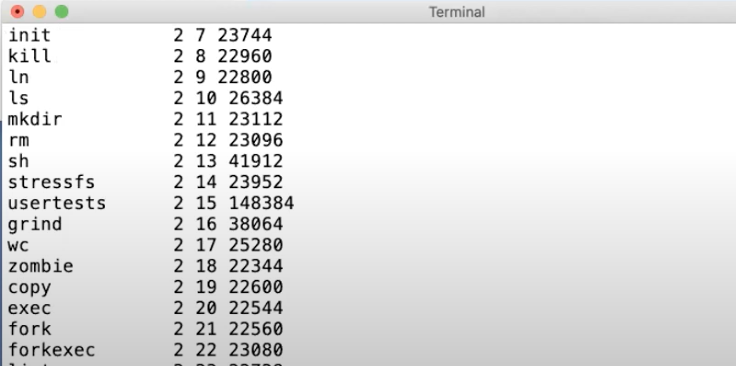

你可以看到第4行，就是一个叫做ls的文件。这就是包含了计算机指令的文件。

除了运行程序以外，Shell还会做一些其他的事情，比如，它允许你能重定向IO。比如，我输入 ls > out。

这里的实际意义是，我要求Shell运行ls命令，但是将输出重定向到一个叫做out的文件中。这里执行完成之后我们看不到任何的输出，因为输出都送到了out文件。现在我们知道out文件包含了一些数据，我们可以通过cat指令读取一个文件，并显示文件的内容。

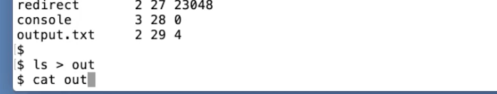

我们将会花很多时间在Shell上，Shell是最传统，最基础的Unix接口。因为当Unix最开始被开发出来时，只有简单的终端接口，例如Shell。Unix最早的用途是给多个用户分时复用机器，用户通过Shell与机器交互。

# fork系统调用

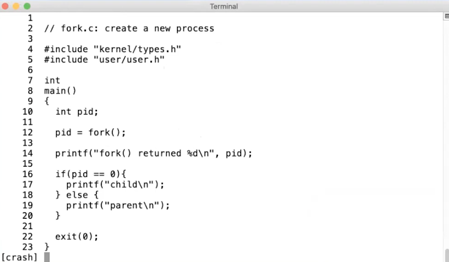

在第12行，我们调用了fork。fork会拷贝当前进程的内存，并创建一个新的进程，这里的内存包含了进程的指令和数据。之后，我们就有了两个拥有完全一样内存的进程。fork系统调用在两个进程中都会返回，在原始的进程中，fork系统调用会返回大于0的整数，这个是新创建进程的ID。而在新创建的进程中，fork系统调用会返回0。所以即使两个进程的内存是完全一样的，我们还是可以通过fork的返回值区分旧进程和新进程。

在第16行，你可以看到代码检查pid。如果pid等于0，那么这必然是子进程。在我们的例子中，调用进程通常称为父进程，父进程看到的pid必然大于0。所以父进程会打印“parent”，子进程会打印“child”。之后两个进程都会退出。接下来我运行这个程序：

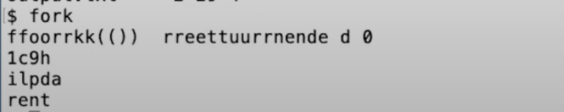

输出看起来像是垃圾数据。这里实际发生的是，fork系统调用之后，两个进程都在同时运行，QEMU实际上是在模拟多核处理器，所以这两个进程实际上就是同时在运行。所以当这两个进程在输出的时候，它们会同时一个字节一个字节的输出，两个进程的输出交织在一起，所以你可以看到两个f，两个o等等。在第一行最后，你可以看到0，这是子进程的输出。我猜父进程返回了19，作为子进程的进程ID。通常来说，这意味着这是操作系统启动之后的第19个进程。之后一个进程输出了child，一个进程输出了parent，这两个输出交织在一起。虽然这只是对于fork的一个简单应用，但是我们可以清晰的从输出看到这里创建了两个运行的进程，其中一个进程打印了child，另一个打印了parent。所以，fork（在子父进程中）返回不同的值是比较重要的。

fork创建了一个新的进程。当我们在Shell中运行东西的时候，Shell实际上会创建一个新的进程来运行你输入的每一个指令。所以，当我输入ls时，我们需要Shell通过fork创建一个进程来运行ls，这里需要某种方式来让这个新的进程来运行ls程序中的指令，加载名为ls的文件中的指令（也就是后面的exec系统调用）。

# exec, wait系统调用

在接下来我展示的一个例子中，会使用echo，echo是一个非常简单的命令，它接收任何你传递给它的输入，并将输入写到输出。


我为你们准备了一个文件名为exec的代码，

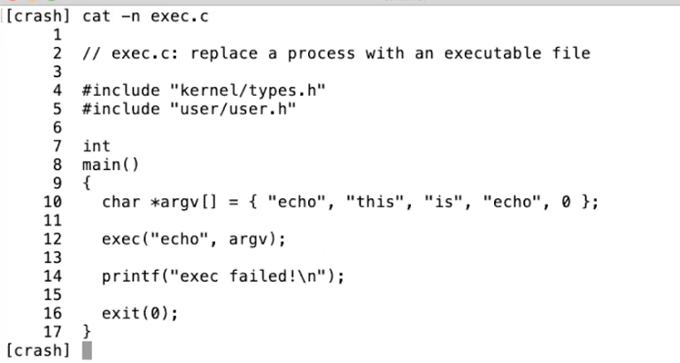

代码会执行exec系统调用，这个系统调用会从指定的文件中读取并加载指令，并替代当前调用进程的指令。从某种程度上来说，这样相当于丢弃了调用进程的内存，并开始执行新加载的指令。所以第12行的系统调用exec会有这样的效果：操作系统从名为echo的文件中加载指令到当前的进程中，并替换了当前进程的内存，之后开始执行这些新加载的指令。同时，你可以传入命令行参数，exec允许你传入一个命令行参数的数组，这里就是一个C语言中的指针数组，在上面代码的第10行设置好了一个字符指针的数组，这里的字符指针本质就是一个字符串（string）。

所以这里等价于运行echo命令，并带上“this is echo” 这三个参数。所以当我运行exec文件，


我可以看到“this is echo”的输出。即使我运行了exec程序，exec程序实际上会调用exec系统调用，并用echo指令来代替自己，所以这里是echo命令在产生输出。

有关exec系统调用，有一些重要的事情，

1.exec系统调用会保留当前的文件描述符表单。所以任何在exec系统调用之前的文件描述符，例如0，1，2等。它们在新的程序中表示相同的东西。

2.通常来说exec系统调用不会返回，因为exec会完全替换当前进程的内存，相当于当前进程不复存在了，所以exec系统调用已经没有地方能返回了。

所以，exec系统调用从文件中读取指令，执行这些指令，然后就没有然后了。exec系统调用只会当出错时才会返回，因为某些错误会阻止操作系统为你运行文件中的指令，例如程序文件根本不存在，因为exec系统调用不能找到文件，exec会返回-1来表示：出错了，我找不到文件。所以通常来说exec系统调用不会返回，它只会在kernel不能运行相应的文件时返回。

好的，这就是一个程序如何用文件中的另一个程序来替代自己。实际上，当我们在Shell中运行类似于“echo a b c”的指令，或者ls，或者任何命令，我们不会想要代替Shell进程，所以我们不会希望Shell执行exec系统调用。如果我们这么做了，这里会用echo指令来替代Shell进程，当echo退出了，一切就结束了。所以我们不想要echo替代Shell。实际上，Shell会执行fork，之后fork出的子进程再调用exec系统调用，这是一个非常常见的Unix程序调用风格。对于那些想要运行程序，但是还希望能拿回控制权的场景，可以先执行fork系统调用，然后在子进程中调用exec。

这里有一个简单的例子，来演示fork/exec程序。

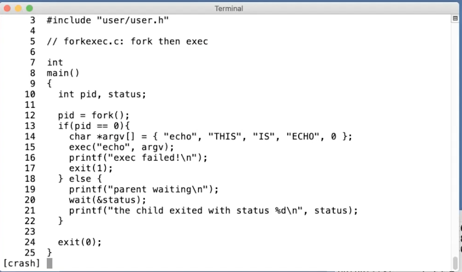

在这个程序中的第12行，调用了fork。子进程从第14行开始，我们在子进程中与前一个程序一样调用exec。子进程会用echo命令来代替自己，echo执行完成之后就退出。之后父进程重新获得了控制。fork会在父进程中返回大于0的值，父进程会继续在第19行执行。

Unix提供了一个wait系统调用，如第20行所示。wait会等待之前创建的子进程退出。当我在命令行执行一个指令时，我们一般会希望Shell等待指令执行完成。所以wait系统调用，使得父进程可以等待任何一个子进程返回。这里wait的参数status，是一种让退出的子进程以一个整数（32bit的数据）的格式与等待的父进程通信方式。所以在第17行，exit的参数是1，操作系统会将1从退出的子进程传递到第20行，也就是等待的父进程处。&status，是将status对应的地址传递给内核，内核会向这个地址写入子进程向exit传入的参数。

Unix中的风格是，如果一个程序成功的退出了，那么exit的参数会是0，如果出现了错误，那么就会像第17行一样，会向exit传递1。所以，如果你关心子进程的状态的话，父进程可以读取wait的参数，并决定子进程是否成功的完成了。

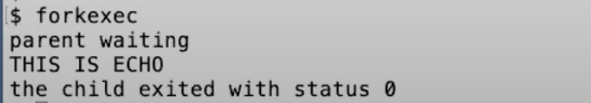

可以看出，程序执行了echo，并传入了相应的参数。同时子进程以状态0退出，表明echo成功的退出了，并且父进程在等待子进程。

接下来，我修改一下代码。这次我将会运行一个不存在的指令，

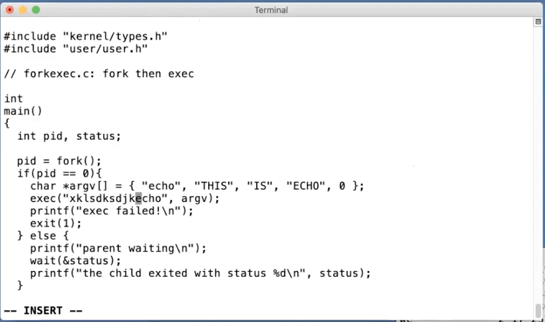

这一次，因为我们想要执行的指令并不存在，exec系统调用会返回，我们可以看到“exec failed!”的输出，同时exit(1)的参数1，传递给了父进程，父进程会打印出子进程的退出码。所以，exec系统调用只会在出错的时候返回给调用进程。

这里有一些东西需要注意，实际上我认为你们很多人已经注意到了，这里是一个常用的写法，先调用fork，再在子进程中调用exec。这里实际上有些浪费，fork首先拷贝了整个父进程的，但是之后exec整个将这个拷贝丢弃了，并用你要运行的文件替换了内存的内容。某种程度上来说这里的拷贝操作浪费了，因为所有拷贝的内存都被丢弃并被exec替换。在大型程序中这里的影响会比较明显。如果你运行了一个几G的程序，并且调用fork，那么实际就会拷贝所有的内存，可能会要消耗将近1秒钟来完成拷贝，这可能会是个问题。

在这门课程的后面，你们会实现一些优化，比如说**copy-on-write fork**，这种方式会消除fork的几乎所有的明显的低效，而只拷贝执行exec所需要的内存，这里需要很多涉及到虚拟内存系统的技巧。你可以构建一个fork，对于内存实行lazy拷贝，通常来说fork之后立刻是exec，这样你就不用实际的拷贝，因为子进程实际上并没有使用大部分的内存。我认为你们会觉得这将是一个有趣的实验。

# I/O Redirect

最后一个例子，我想展示一下将所有这些工具结合在一起，来实现I/O重定向。

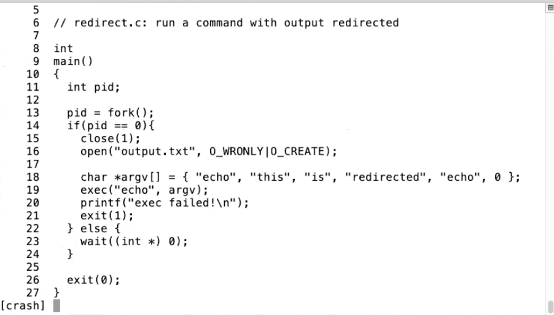

我们之前讲过，Shell提供了方便的I/O重定向工具。如果我运行下面的指令


Shell会将echo的输出送到文件out。之后我们可以运行cat指令，并将out文件作为输入，


我们可以看到保存在out文件中的内容就是echo指令的输出。

Shell之所以有这样的能力，是因为Shell首先会像第13行一样fork，然后在子进程中，Shell改变了文件描述符。文件描述符1通常是进程用来作为输出的（也就是console的输出文件符），Shell会将文件描述符1改为output文件，之后再运行你的指令。同时，父进程的文件描述符1并没有改变。所以这里先fork，再更改子进程的文件描述符，是Unix中的常见的用来重定向指令的输入输出的方法，这种方法同时又不会影响父进程的输入输出。因为我们不会想要重定向Shell的输出，我们只想重定向子进程的输出。

这里之所以能工作的原因是，代码的第15行只会在子进程中执行。代码的第15行的意义是重定向echo命令的输出，如果我运行整个程序redirect程序。


可以看到没有任何的输出。但是实际上redirect程序里面运行了echo，只是echo的输出重定向到了output.txt。如果我们查看output.txt，


我们可以看到预期的输出。代码第15行的close(1)的意义是，我们希望文件描述符1指向一个其他的位置。也就是说，在子进程中，我们不想使用原本指向console输出的文件描述符1。

代码第16行的open一定会返回1，因为open会返回当前进程未使用的最小文件描述符序号。因为我们刚刚关闭了文件描述符1，而文件描述符0还对应着console的输入，所以open一定可以返回1。在代码第16行之后，文件描述符1与文件output.txt关联。

之后我们执行exec(echo)，echo会输出到文件描述符1，也就是文件output.txt。这里有意思的地方是，echo根本不知道发生了什么，echo也没有必要知道I/O重定向了，它只是将自己的输出写到了文件描述符1。只有Shell知道I/O重定向了。

这个例子同时也演示了分离fork和exec的好处。fork和exec是分开的系统调用，意味着在子进程中有一段时间，fork返回了，但是exec还没有执行，子进程仍然在运行父进程的指令。所以这段时间，尽管指令是运行在子进程中，但是这些指令仍然是父进程的指令，所以父进程仍然可以改变东西，直到代码执行到了第19行。这里fork和exec之间的间隔，提供了Shell修改文件描述符的可能。


