阅读xv6 book第二章

阅读xv6源代码：: kernel/proc.h, kernel/defs.h, kernel/entry.S, kernel/main.c, user/initcode.S, user/init.c, and skim kernel/proc.c and kernel/exec.c

# 上一节课回顾

这节课的内容是操作系统的组织结构。今天我们主要讨论4个话题：

- Isolation。隔离性是设计操作系统组织结构的驱动力。
- Kernel和User mode。这两种模式用来隔离操作系统内核和用户应用程序。
- System calls。系统调用是你的应用程序能够转换到内核执行的基本方法，这样你的用户态应用程序才能使用内核服务。
- 最后我们会看到所有的这些是如何以一种简单的方式在XV6中实现。

首先我们来复习一下上一节课。学习完第一课之后，你应该对操作系统的结构有个大致的认知。

- 首先，会有类似于Shell，echo，find或者任何你实现的工具程序，这些程序运行在操作系统之上。
- 而操作系统又抽象了一些硬件资源，例如磁盘，CPU。
- 通常来说操作系统和应用程序之前的接口被称为系统调用接口（System call interface），我们这门课程看到的接口都是Unix风格的接口。基于这些Unix接口，你们在lab1中，完成了不同的应用程序。

lab1主要集中在理解上图中的**应用程序到操作系统内核之间的接口**。而我们这节课以及后面的许多节课，都会实际查看，在操作系统内核中，这些接口是如何实现的。

实际上，在这个学期，我们都会花时间来理解如何实现操作系统接口（也就是系统调用接口），所以这是第一节有关这些内容的课。你们通过邮件和网站提出了很多非常棒的问题，我们现在还不能立即开始很多细节的讨论，因为讨论这些细节需要仔细检查操作系统的内部实现，而毕竟这是第一节讨论实现的课程。我们这节课会讨论很多东西，但是很多东西会在后面的课程变得更加清晰，因为我们会在后面的课程进行更加深入的讨论。不管怎样，如果有哪个地方不太清楚，请随时打断我并把问题提出来。

# 操作系统隔离性（isolation）

我们首先来简单的介绍一下隔离性（isolation），以及介绍为什么它很重要，为什么我们需要关心它？

这里的核心思想相对来说比较简单。我们在用户空间有多个应用程序，例如Shell，echo，find。但是，如果你通过Shell运行你们的Prime代码（lab1中的一个部分）时，假设你们的代码出现了问题，Shell不应该会影响到其他的应用程序。举个反例，如果Shell出现问题时，杀掉了其他的进程，这将会非常糟糕。所以你需要在不同的应用程序之间有强隔离性。

类似的，操作系统某种程度上为所有的应用程序服务。当你的应用程序出现问题时，你会希望操作系统不会因此而崩溃。比如说你向操作系统传递了一些奇怪的参数，你会希望操作系统仍然能够很好的处理它们（能较好的处理异常情况）。所以，你也需要在应用程序和操作系统之间有强隔离性。

这里我们可以这样想，如果没有操作系统会怎样？我们可以用稻草人提案法（就是通过头脑风暴找出缺点）来考虑一下，如果没有操作系统，或者操作系统只是一些库文件，比如说你在使用Python，通过import os你就可以将整个操作系统加载到你的应用程序中。那么现在，我们有一个Shell，并且我们引用了代表操作系统的库。同时，我们有一些其他的应用程序例如，echo。

通常来说，如果没有操作系统，应用程序会直接与硬件交互。比如，应用程序可以直接看到CPU的多个核，看到磁盘，内存。所以现在应用程序和硬件资源之间没有一个额外的抽象层，如下图所示。

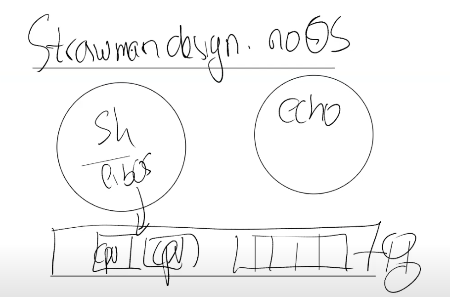

实际上，从隔离性的角度来看，这并不是一个很好的设计。这里你可以看到这种设计是如何破坏隔离性的。使用操作系统的一个目的是为了同时运行多个应用程序，所以时不时的，CPU会从一个应用程序切换到另一个应用程序。我们假设硬件资源里只有一个CPU核，并且我们现在在这个CPU核上运行Shell。但是时不时的，也需要让其他的应用程序也可以运行。现在我们没有操作系统来帮我们完成切换，所以Shell就需要时不时的释放CPU资源。

为了不变成一个恶意程序，Shell在发现自己运行了一段时间之后，需要让别的程序也有机会能运行。这种机制有时候称为协同调度（Cooperative Scheduling）。但是这里的场景并没有很好的隔离性，比如说Shell中的某个函数有一个死循环，那么Shell永远也不会释放CPU，进而其他的应用程序也不能够运行，甚至都不能运行一个第三方的程序来停止或者杀死Shell程序。所以这种场景下，我们基本上得不到真正的multiplexing（CPU在多进程同分时复用）。而这个特性是非常有用的，不论应用程序在执行什么操作，**multiplexing都会迫使应用程序时不时的释放CPU**，这样其他的应用程序才能运行。

从内存的角度来说，如果应用程序直接运行在硬件资源之上，那么每个应用程序的文本，代码和数据都直接保存在物理内存中。物理内存中的一部分被Shell使用，另一部分被echo使用。

即使在这么简单的例子中，因为两个应用程序的内存之间没有边界，如果echo程序将数据存储在属于Shell的一个内存地址中（下图中的1000），那么就echo就会覆盖Shell程序内存中的内容。

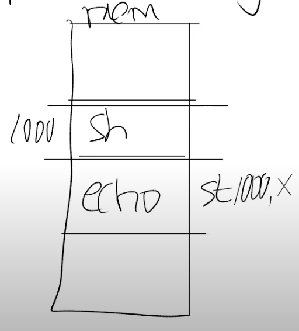

这是非常不想看到的场景，因为echo现在渗透到了Shell中来，并且这类的问题是非常难定位的。所以这里也没有为我们提供好的隔离性。我们希望不同应用程序之间的内存是隔离的，这样一个应用程序就不会覆盖另一个应用程序的内存。

使用操作系统的一个原因，甚至可以说是主要原因就是为了实现multiplexing和内存隔离。如果你不使用操作系统，并且应用程序直接与硬件交互，就很难实现这两点。所以，将操作系统设计成一个库，并不是一种常见的设计。你或许可以在一些实时操作系统中看到这样的设计，因为在这些实时操作系统中，应用程序之间彼此相互信任。但是在大部分的其他操作系统中，都会强制实现硬件资源的隔离。

如果我们从隔离的角度来稍微看看Unix接口，那么我们可以发现，接口被精心设计以实现资源的强隔离，也就是multiplexing和物理内存的隔离。接口通过抽象硬件资源，从而使得提供强隔离性成为可能。

接下来我们举几个例子。

之前通过fork创建了进程。进程本身不是CPU，但是它们对应了CPU，它们使得你可以在CPU上运行计算任务。所以你懂的，应用程序不能直接与CPU交互，只能与进程交互。操作系统内核会完成不同进程在CPU上的切换。所以，操作系统不是直接将CPU提供给应用程序，而是向应用程序提供“进程”，进程抽象了CPU，这样操作系统才能在多个应用程序之间复用一个或者多个CPU。

我们可以认为exec抽象了内存。当我们在执行exec系统调用的时候，我们会传入一个文件名，而这个文件名对应了一个应用程序的内存镜像。内存镜像里面包括了程序对应的指令，全局的数据。应用程序可以逐渐扩展自己的内存，但是应用程序并没有直接访问物理内存的权限，例如应用程序不能直接访问物理内存的1000-2000这段地址。不能直接访问的原因是，操作系统会提供内存隔离并控制内存，操作系统会在应用程序和硬件资源之间提供一个中间层。exec是这样一种系统调用，它表明了应用程序不能直接访问物理内存。

另一个例子是files，files基本上来说抽象了磁盘。应用程序不会直接读写挂在计算机上的磁盘本身，并且在Unix中这也是不被允许的。在Unix中，与存储系统交互的唯一方式就是通过files。Files提供了非常方便的磁盘抽象，你可以对文件命名，读写文件等等。之后，操作系统会决定如何将文件与磁盘中的块对应，确保一个磁盘块只出现在一个文件中，并且确保用户A不能操作用户B的文件。通过files的抽象，可以实现不同用户之间和同一个用户的不同进程之间的文件强隔离。

这些都是你们在上一个lab中使用的Unix系统调用接口，或许你们已经看出来了，这些接口看起来像是经过精心的设计以抽象计算机资源，这样这些接口的实现，或者说操作系统本身可以在多个应用程序之间复用计算机硬件资源，同时还提供了强隔离性。

# 操作系统防御性（Defensive）

现在我们有一个操作系统，并且有一些应用程序正在运行。这里有一件事情需要考虑：操作系统应该具有防御性（Defensive）。

当你在做内核开发时，这是一种你需要熟悉的重要思想。操作系统需要确保所有的组件都能工作，所以它需要做好准备抵御来自应用程序的攻击。如果说**应用程序无意或者恶意的向系统调用传入一些错误的参数就会导致操作系统崩溃**，那就太糟糕了。在这种场景下，操作系统因为崩溃了会拒绝为其他所有的应用程序提供服务。所以操作系统需要以这样一种方式来完成：操作系统需要能够应对恶意的应用程序。

另一个需要考虑的是，应用程序不能够打破对它的隔离。应用程序非常有可能是恶意的，它或许是由攻击者写出来的，攻击者或许想要打破对应用程序的隔离，进而控制内核。一旦有了对于内核的控制能力，你可以做任何事情，因为内核控制了所有的硬件资源。

所以操作系统或者说内核需要具备防御性来避免类似的事情发生。实际中，要满足这些要求还有点棘手。在Linux中，时不时的有一些内核的bug使得应用程序可以打破它的隔离域并控制内核。这里需要持续的关注，并尽可能的提供最好的防御性。当你在开发内核时，防御性是你必须掌握的一个思想。实际中的应用程序或许就是恶意的，这意味着我们需要在**应用程序和操作系统之间提供强隔离性**。如果操作系统需要具备防御性，那么在应用程序和操作系统之间需要有一堵厚墙，并且操作系统可以在这堵墙上执行任何它想执行的策略。

通常来说，需要通过**硬件来实现这种强隔离性**。我们这节课会简单介绍一些硬件隔离的内容，但是在后续的课程我们会介绍的更加详细。这里的硬件支持包括了两部分，第一部分是user/kernel mode，kernel mode在RISC-V中被称为Supervisor mode但是其实是同一个东西；第二部分是page table或者虚拟内存（Virtual Memory）。

所以，所有的处理器，如果需要运行能够支持多个应用程序的操作系统，需要同时支持user/kernle mode和虚拟内存。具体的实现或许会有细微的差别，但是基本上来说所有的处理器需要能支持这些。我们在这门课中使用的RISC-V处理器就支持了这些功能。

# 硬件对于强隔离的支持

硬件对于强隔离的支持包括了：user/kernle mode和虚拟内存。

首先，我们来看一下user/kernel mode，这里会以尽可能全局的视角来介绍，有很多重要的细节在这节课中都不会涉及。为了支持user/kernel mode，处理器会有两种操作模式，第一种是user mode，第二种是kernel mode。**当运行在kernel mode时，CPU可以运行特定权限的指令（privileged instructions）；当运行在user mode时，CPU只能运行普通权限的指令（unprivileged instructions）。**

普通权限的指令都是一些你们熟悉的指令，例如将两个寄存器相加的指令ADD、将两个寄存器相减的指令SUB、跳转指令JRC、BRANCH指令等等。这些都是普通权限指令，所有的应用程序都允许执行这些指令。

特殊权限指令主要是一些直接操纵硬件的指令和设置保护的指令，例如设置page table寄存器、关闭时钟中断。在处理器上有各种各样的状态，操作系统会使用这些状态，但是只能通过特殊权限指令来变更这些状态。

举个例子，当一个应用程序尝试执行一条特殊权限指令，因为不允许在user mode执行特殊权限指令，处理器会拒绝执行这条指令。通常来说，这时会将控制权限从user mode切换到kernel mode，当操作系统拿到控制权之后，或许会杀掉进程，因为应用程序执行了不该执行的指令。

下图是RISC-V privilege架构的文档，这个文档包括了所有的特殊权限指令。在接下来的一个月，你们都会与这些特殊权限指令打交道。我们下节课就会详细介绍其中一些指令。这里我们先对这些指令有一些初步的认识：**应用程序不应该执行这些指令，这些指令只能被内核执行**。

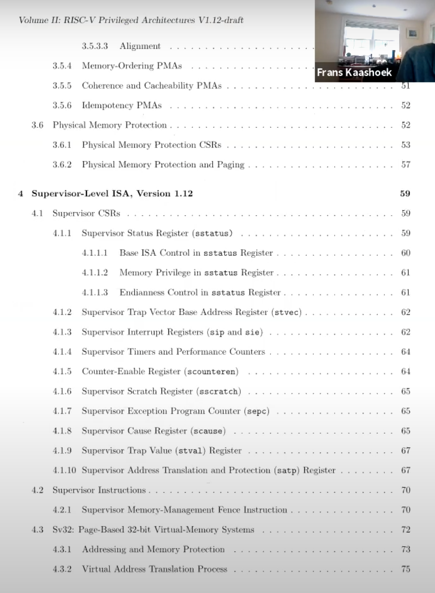

实际上RISC-V还有第三种模式称为machine mode。在大多数场景下，我们会忽略这种模式，所以我也不太会介绍这种模式。 所以实际上我们有三级权限（user/kernel/machine），而不是两级(user/kernel)。

我们接下来看看硬件对于支持强隔离性的第二个特性，基本上所有的CPU都支持**虚拟内存**。我下节课会更加深入的讨论虚拟内存，这里先简单看一下。基本上来说，处理器包含了page table，而page table将**虚拟内存地址与物理内存地址**做了对应。

每一个进程都会有自己独立的page table，这样的话，**每一个进程只能访问出现在自己page table中的物理内存**。操作系统会设置page table，使得每一个进程都有不重合的物理内存，这样一个进程就不能访问其他进程的物理内存，因为其他进程的物理内存都不在它的page table中。一个进程甚至都不能随意编造一个内存地址，然后通过这个内存地址来访问其他进程的物理内存。这样就给了我们内存的强隔离性。

基本上来说，page table定义了对于内存的视图，而每一个用户进程都有自己对于内存的独立视图。这给了我们非常强的内存隔离性。

基于硬件的支持，我们可以重新画一下之前的一张图，我们先画一个矩形，ls程序位于这个矩形中；再画一个矩形，echo程序位于这个矩形中。每个矩形都有一个虚拟内存地址，从0开始到2的n次方。

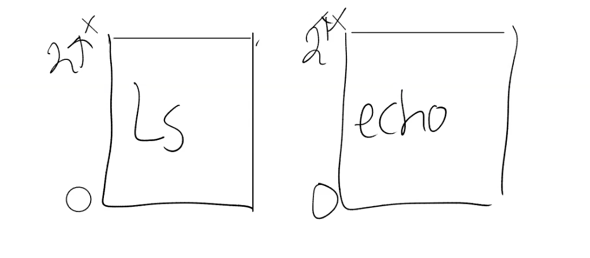

这样，ls程序有了一个内存地址0，echo程序也有了一个内存地址0。但是操作系统会将两个程序的内存地址0映射到不同的物理内存地址，所以ls程序不能访问echo程序的内存，同样echo程序也不能访问ls程序的内存。

类似的，内核位于应用程序下方，假设是XV6，那么它也有自己的内存地址空间，并且与应用程序完全独立。

# User/Kernel mode切换

我们可以认为user/kernel mode是分隔用户空间和内核空间的边界，用户空间运行的程序运行在user mode，内核空间的程序运行在kernel mode。操作系统位于内核空间。

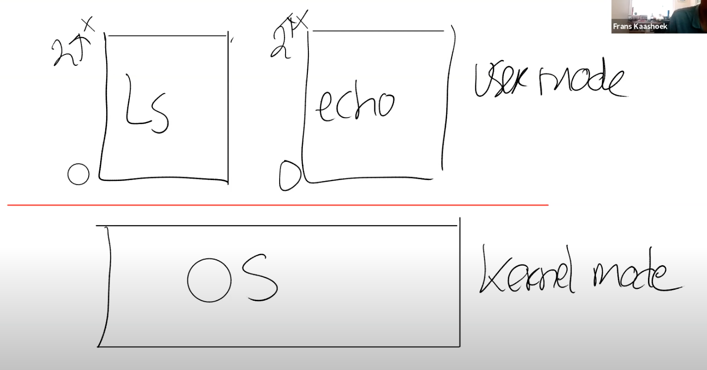

你们应该将这张图记在你们的脑子中。但是基于我们已经介绍的内容，这张图有点太过严格了。因为我们用矩形包括了一个程序的所有部分，但是这里没有描述如何从一个矩形将控制权转移到另一个矩形的，而很明显这种转换是需要的，例如当ls程序运行的时候，会调用read/write系统调用；Shell程序会调用fork或者exec系统调用，所以**必须要有一种方式可以使得用户的应用程序能够将控制权以一种协同工作的方式转移到内核，这样内核才能提供相应的服务。**

所以，需要有一种方式能够让应用程序可以将控制权转移给内核（Entering Kernel）。

在RISC-V中，有一个专门的指令用来实现这个功能，叫做ECALL。ECALL接收一个数字参数，当一个用户程序想要将程序执行的控制权转移到内核，它只需要执行ECALL指令，并传入一个数字。这里的数字参数代表了应用程序想要调用的System Call。

ECALL会跳转到内核中一个特定，由内核控制的位置。我们在这节课的最后可以看到在XV6中存在一个唯一的系统调用接入点，每一次应用程序执行ECALL指令，应用程序都会通过这个接入点进入到内核中。举个例子，不论是Shell还是其他的应用程序，当它在用户空间执行fork时，它并不是直接调用操作系统中对应的函数，而是调用ECALL指令，并将fork对应的数字作为参数传给ECALL。之后再通过ECALL跳转到内核。

下图中通过一根竖线来区分用户空间和内核空间，左边是用户空间，右边是内核空间。在内核侧，有一个位于syscall.c的函数syscall，每一个从应用程序发起的系统调用都会调用到这个syscall函数，syscall函数会检查ECALL的参数，通过这个参数内核可以知道需要调用的是fork（3.9会有相应的代码跟踪介绍）。

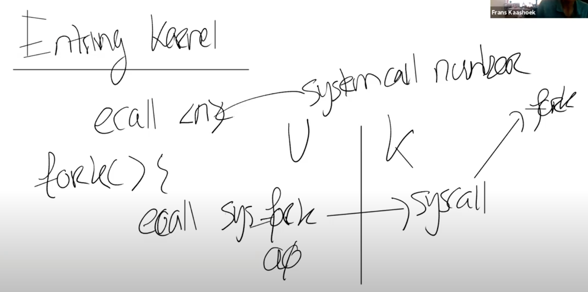

这里需要澄清的是，用户空间和内核空间的界限是一个硬性的界限，用户不能直接调用fork，用户的应用程序执行系统调用的唯一方法就是通过这里的ECALL指令。

假设我现在要执行另一个系统调用write，相应的流程是类似的，write系统调用不能直接调用内核中的write代码，而是由封装好的系统调用函数执行ECALL指令。所以write函数实际上调用的是ECALL指令，指令的参数是代表了write系统调用的数字。之后控制权到了syscall函数，syscall会实际调用write系统调用。

# 宏内核 vs 微内核 （Monolithic Kernel vs Micro Kernel）

现在，我们有了一种方法，可以通过系统调用或者说ECALL指令，将控制权从应用程序转到操作系统中。之后内核负责实现具体的功能并检查参数以确保不会被一些坏的参数所欺骗。所以内核有时候也被称为可被信任的计算空间（Trusted Computing Base），在一些安全的术语中也被称为TCB。

基本上来说，要被称为TCB，内核首先要是正确且没有Bug的。假设内核中有Bug，攻击者可能会利用那个Bug，并将这个Bug转变成漏洞，这个漏洞使得攻击者可以打破操作系统的隔离性并接管内核。所以内核真的是需要越少的Bug越好（但是谁不是呢）。

另一方面，内核必须要将用户应用程序或者进程当做是恶意的。如我之前所说的，内核的设计人员在编写和实现内核代码时，必须要有安全的思想。这个目标很难实现，因为当你的操作系统变得足够大的时候，很多事情就不是那么直观了。你知道的，几乎每一个你用过的或者被广泛使用的操作系统，时不时的都有一个安全漏洞。就算被修复了，但是过了一段时间，又会出现一个新的漏洞。我们之后会介绍为什么很难让所有部分都正确工作，但是你要知道是内核需要做一些tricky的工作，需要操纵硬件，需要非常小心做检查，所以很容易就出现一些小的疏漏，进而触发一个Bug。这也是可以理解的。

一个有趣的问题是，什么程序应该运行在kernel mode？敏感的代码肯定是运行在kernel mode，因为这是Trusted Computing Base。

对于这个问题的一个答案是，首先我们会有user/kernel边界，在上面是应用程序，在下面是运行在kernel mode的程序。

其中一个选项是让**整个操作系统代码都运行在kernel mode**。大多数的Unix操作系统实现都运行在kernel mode。比如，XV6中，所有的操作系统服务都在kernel mode中，这种形式被称为Monolithic Kernel Design（宏内核）。

这里有几件事情需要注意：

- 首先，如果考虑Bug的话，这种方式不太好。在一个宏内核中，任何一个操作系统的Bug都有可能成为漏洞。因为我们现在在内核中运行了一个巨大的操作系统，出现Bug的可能性更大了。你们可以去查一些统计信息，平均每3000行代码都会有几个Bug，所以如果有许多行代码运行在内核中，那么出现严重Bug的可能性也变得更大。所以从安全的角度来说，在内核中有大量的代码是宏内核的缺点。
- 另一方面，如果你去看一个操作系统，它包含了各种各样的组成部分，比如说文件系统，虚拟内存，进程管理，这些都是操作系统内实现了特定功能的子模块。宏内核的优势在于，因为这些子模块现在都位于同一个程序中，它们可以紧密的集成在一起，这样的集成提供很好的性能。例如Linux，它就有很不错的性能。

上面是对于内核的一种设计方式。

另一种设计主要关注点是减少内核中的代码，它被称为Micro Kernel Design（微内核）。在这种模式下，希望在kernel mode中运行尽可能少的代码。所以这种设计下还是有内核，但是内核只有非常少的几个模块，例如，内核通常会有一些IPC的实现或者是Message passing；非常少的虚拟内存的支持，可能只支持了page table；以及分时复用CPU的一些支持。

微内核的目的在于将大部分的操作系统运行在内核之外。所以，我们还是会有user mode以及user/kernel mode的边界。但是我们现在会将原来在内核中的其他部分，作为普通的用户程序来运行。比如文件系统可能就是个常规的用户空间程序。文件系统运行的就像一个普通的用户程序，就像echo，Shell一样，这些程序都运行在用户空间。可能还会有一些其他的用户应用程序，例如虚拟内存系统的一部分也会以一个普通的应用程序的形式运行在user mode。

某种程度上来说，这是一种好的设计。因为在内核中的代码的数量较小，更少的代码意味着更少的Bug。

但是这种设计也有相应的问题。假设我们需要让Shell能与文件系统交互，比如Shell调用了exec，必须有种方式可以接入到文件系统中。通常来说，这里工作的方式是，Shell会通过内核中的IPC（Inter Process Communication）系统发送一条消息，内核会查看这条消息并发现这是给文件系统的消息，之后内核会把消息发送给文件系统。

文件系统会完成它的工作之后会向IPC系统发送回一条消息说，这是你的exec系统调用的结果，之后IPC系统再将这条消息发送给Shell。

所以，这里是典型的通过消息来实现传统的系统调用。现在，对于任何文件系统的交互，都需要分别完成2次用户空间<->内核空间的跳转。与宏内核对比，在宏内核中如果一个应用程序需要与文件系统交互，只需要完成1次用户空间<->内核空间的跳转，所以微内核的的跳转是宏内核的两倍。通常微内核的挑战在于性能更差，这里有两个方面需要考虑：

1.在user/kernel mode反复跳转带来的性能损耗。

2.在一个类似宏内核的紧耦合系统，各个组成部分，例如文件系统和虚拟内存系统，可以很容易的共享page cache。而在微内核中，每个部分之间都很好的隔离开了，这种共享更难实现。进而导致更难在微内核中得到更高的性能。

我们这里介绍的有关宏内核和微内核的区别都特别的笼统。在实际中，两种内核设计都会出现，出于历史原因大部分的桌面操作系统是宏内核，如果你运行需要大量内核计算的应用程序，例如在数据中心服务器上的操作系统，通常也是使用的宏内核，主要的原因是Linux提供了很好的性能。但是很多嵌入式系统，例如Minix，Cell，这些都是微内核设计。这两种设计都很流行，如果你从头开始写一个操作系统，你可能会从一个微内核设计开始。但是一旦你有了类似于Linux这样的宏内核设计，将它重写到一个微内核设计将会是巨大的工作。并且这样重构的动机也不足，因为人们总是想把时间花在实现新功能上，而不是重构他们的内核。

所以这里是操作系统的两种主要设计。如你们所知的，XV6是一种宏内核设计，如大多数经典的Unix系统一样。但是在这个学期的后半部分，我们会讨论更多有关微内核设计的内容。

# 编译运行kernel

接下来我会切换到代码介绍，来看一下XV6是如何工作的。

首先，我们来看一下代码结构，你们或许已经看过了。代码主要有三个部分组成：

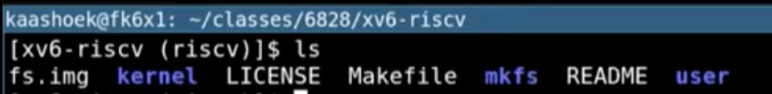

第一个是kernel。我们可以ls kernel的内容，里面包含了基本上所有的内核文件。因为XV6是一个宏内核结构，这里所有的文件会被编译成一个叫做kernel的二进制文件，然后这个二进制文件会被运行在kernle mode中。

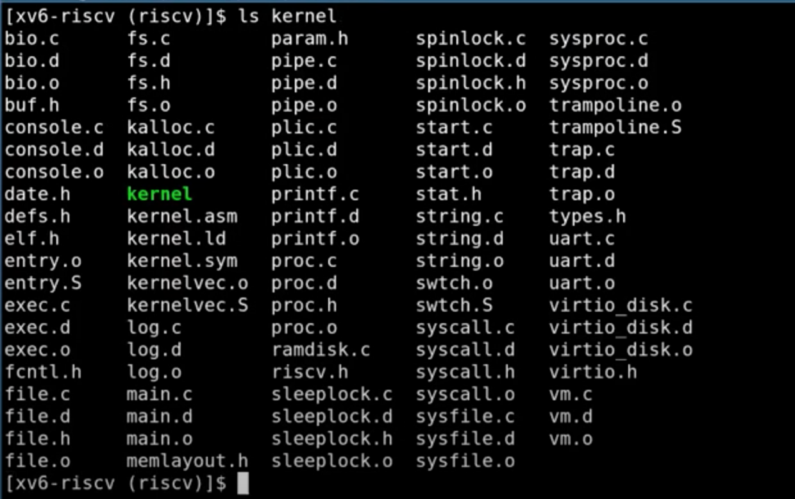

第二个部分是user。这基本上是运行在user mode的程序。这也是为什么一个目录称为kernel，另一个目录称为user的原因。

第三部分叫做mkfs。它会**创建一个空的文件镜像，我们会将这个镜像存在磁盘上**，这样我们就可以直接使用一个空的文件系统。

接下来，我想简单的介绍一下内核是如何编译的。你们可能已经编译过内核，但是还没有真正的理解编译过程，这个过程还是比较重要的。

首先，Makefile（XV6目录下的文件）会读取一个C文件，例如proc.c；之后调用gcc编译器，生成一个文件叫做proc.s，这是RISC-V 汇编语言文件；之后再走到汇编解释器，生成proc.o，这是汇编语言的二进制格式。

Makefile会为所有内核文件做相同的操作，比如说pipe.c，会按照同样的套路，先经过gcc编译成pipe.s，再通过汇编解释器生成pipe.o。

之后，系统加载器（Loader）会收集所有的.o文件，将它们链接在一起，并生成内核文件。

这里生成的内核文件就是我们将会在QEMU中运行的文件。同时，为了你们的方便，Makefile还会创建kernel.asm，这里包含了内核的完整汇编语言，你们可以通过查看它来定位究竟是哪个指令导致了Bug。比如，我接下来查看kernel.asm文件，我们可以看到用汇编指令描述的内核：

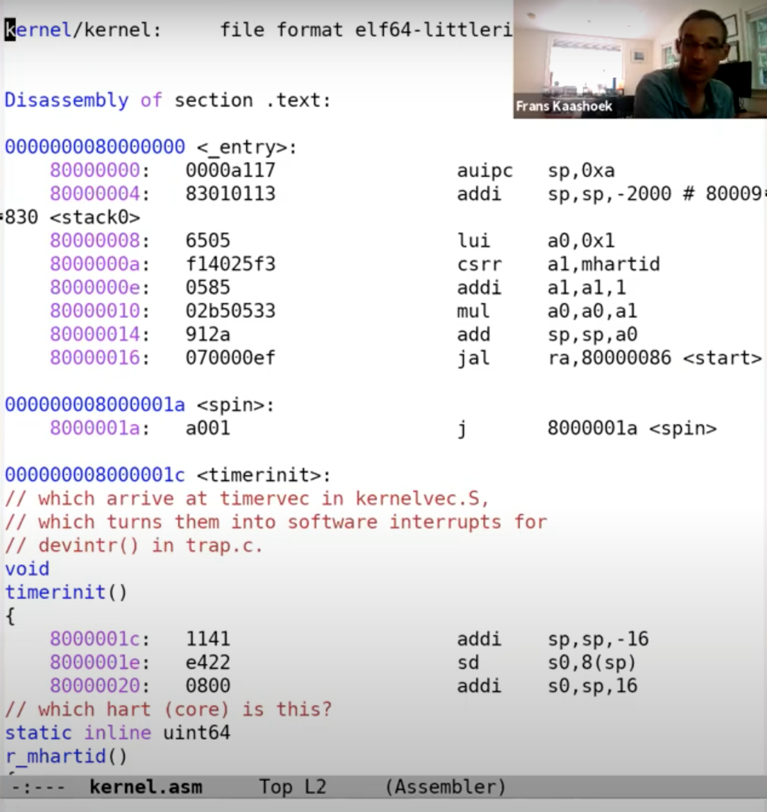

这里你们可能已经注意到了，第一个指令位于地址0x80000000，对应的是一个RISC-V指令：auipc指令。有人知道第二列，例如0x0000a117、0x83010113、0x6505，是什么意思吗？有人想来回答这个问题吗？所以这里0x0000a117就是auipc，这里是二进制编码后的指令。因为每个指令都有一个二进制编码，kernel的asm文件会显示这些二进制编码。当你在运行gdb时，如果你想知道具体在运行什么，你可以看具体的二进制编码是什么，有的时候这还挺方便的。

接下来，让我们不带gdb运行XV6（make会读取Makefile文件中的指令）。这里会编译文件，然后调用QEMU（qemu-system-riscv64指令）。这里本质上是通过C语言来模拟仿真RISC-V处理器。

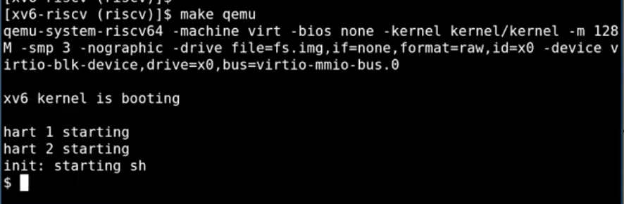

我们来看传给QEMU的几个参数：

- -kernel：这里传递的是内核文件（kernel目录下的kernel文件），这是将在QEMU中运行的程序文件。
- -m：这里传递的是RISC-V虚拟机将会使用的内存数量
- -smp：这里传递的是虚拟机可以使用的CPU核数
- -drive：传递的是虚拟机使用的磁盘驱动，这里传入的是fs.img文件

这样，XV6系统就在QEMU中启动了。

# QEMU

QEMU表现的就像一个真正的计算机一样。当你想到QEMU时，你不应该认为它是一个C程序，你应该把它想成是下图，一个真正的主板。

图中是一个我办公室中的RISC-V主板，它可以启动一个XV6。当你通过QEMU来运行你的内核时，你应该认为你的内核是运行在这样一个主板之上。主板有一个开关，一个RISC-V处理器，有支持外设的空间，比如说一个接口是连接网线的，一个是PCI-E插槽，主板上还有一些内存芯片，这是一个你可以在上面编程的物理硬件，而XV6操作系统管理这样一块主板，你在你的脑海中应该有这么一张图。

对于RISC-V，有完整的文档介绍，比如说下图是一个RISC-V的结构图：

这个图里面有：

- 4个核：U54 Core 1-4
- L2 cache：Banked L2
- 连接DRAM的连接器：DDR Controller
- 各种连接外部设备的方式，比如说UART0，一端连接了键盘，另一端连接了terminal。
- 以及连接了时钟的接口：Clock Generation

我们后面会讨论更多的细节，但是这里基本上就是RISC-V处理器的所有组件，你通过它与实际的硬件交互。

实际上抛开一些细节，通过QEMU模拟的计算机系统或者说计算机主板，与这里由SiFive生产的计算机主板非常相似。本来想给你们展示一下这块主板的，但是我刚刚说过它在我的办公室，而我已经很久没去过办公室了，或许它已经吃了很多灰了。当你们在运行QEMU时，你们需要知道，你们基本上跟在运行硬件是一样的，只是说同样的东西，QEMU在软件中实现了而已。

当我们说QEMU仿真了RISC-V处理器时，背后的含义是什么？

直观来看，QEMU是一个大型的开源C程序，你可以下载或者git clone它。但是在内部，在QEMU的主循环中，只在做一件事情：

- 读取4字节或者8字节的RISC-V指令。
- 解析RISC-V指令，并找出对应的操作码（op code）。我们之前在看kernel.asm的时候，看过一些操作码的二进制版本。通过解析，或许可以知道这是一个ADD指令，或者是一个SUB指令。
- 之后，在软件中执行相应的指令。

这基本上就是QEMU的全部工作了，对于每个CPU核，QEMU都会运行这么一个循环。

为了完成这里的工作，QEMU的主循环需要维护寄存器的状态。所以QEMU会有以C语言声明的类似于X0，X1寄存器等等。

当QEMU在执行一条指令，比如(ADD a0, 7, 1)，这里会将常量7和1相加，并将结果存储在a0寄存器中，所以在这个例子中，寄存器X0会是7。

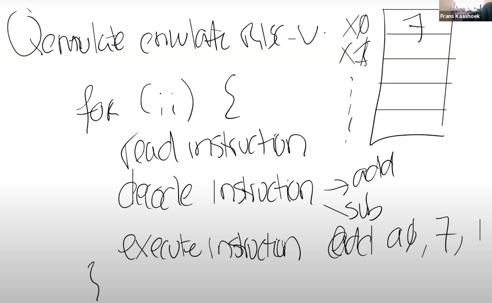

之后QEMU会执行下一条指令，并持续不断的执行指令。除了仿真所有的普通权限指令之外，QEMU还会仿真所有的特殊权限指令，这就是QEMU的工作原理。对于你们来说，你们只需要认为你们跑在QEMU上的代码跟跑在一个真正的RISC-V处理器上是一样的，就像你们在6.004这门课程中使用过的RISC-V处理器一样。

# XV6 启动过程

接下来，我会系统的介绍XV6，让你们对XV6的结构有个大概的了解。在后面的课程，我们会涉及到更多的细节。

首先，我会启动QEMU，并打开gdb。本质上来说QEMU内部有一个gdb server，当我们启动之后，QEMU会等待gdb客户端连接。

指令为make CPUS=1 qemu-gdb

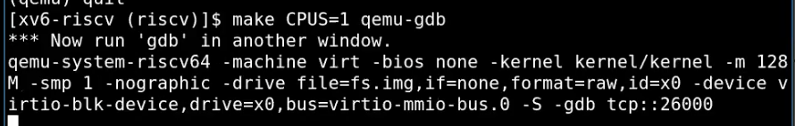

我会在我的计算机上再启动一个gdb客户端，这里是一个RISC-V 64位Linux的gdb，有些同学的电脑可能是multi-arch或者其他版本的的gdb，但是基本上来说，这里的gdb是为RISC-V 64位处理器编译的。

在连接上之后，我会在程序的入口处设置一个断点(b _entry)，因为我们知道这是QEMU会跳转到的第一个指令。

指令为：riscv64-linux-gnu-gdb（在自己的实验过程中安装的gdb是riscv64-unknown-elf-gdb

设置完断点之后，我运行程序，可以发现代码并没有停在0x8000000（见3.7 kernel.asm中，0x80000000是程序的起始位置），而是停在了0x8000000a。

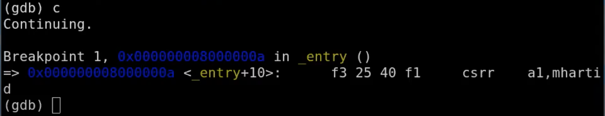

如果我们查看kernel的汇编文件，

我们可以看到，在地址0x8000000a读取了控制系统寄存器（Control System Register）mhartid，并将结果加载到了a1寄存器。所以QEMU会模拟执行这条指令，之后执行下一条指令。

地址0x80000000是一个被QEMU认可的地址。也就是说如果你想使用QEMU，那么第一个指令地址必须是它。所以，我们会让内核加载器从那个位置开始加载内核。如果我们查看kernel.ld，

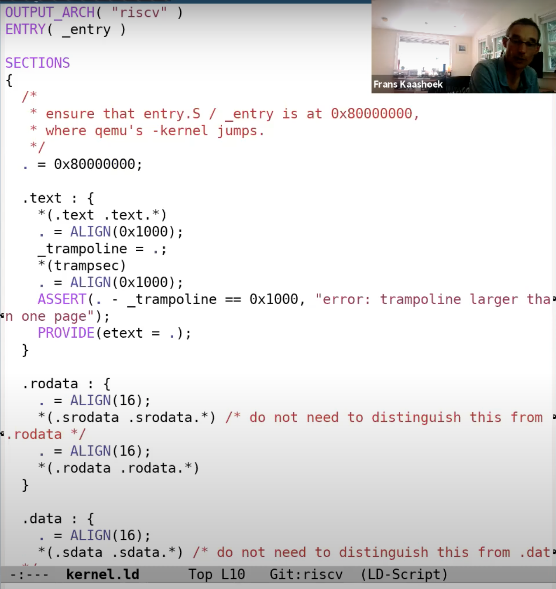

我们可以看到，这个文件定义了内核是如何被加载的，从这里也可以看到，内核使用的起始地址就是QEMU指定的0x80000000这个地址。这就是我们操作系统最初运行的步骤。

回到gdb，我们可以看到gdb也显示了指令的二进制编码

可以看出，csrr是一个4字节的指令，而addi是一个2字节的指令。

我们这里可以看到，XV6从entry.s开始启动，这个时候没有内存分页，没有隔离性，并且运行在M-mode（machine mode）。XV6会尽可能快的跳转到kernel mode或者说是supervisor mode。我们在main函数设置一个断点，main函数已经运行在supervisor mode了。接下来我运行程序，代码会在断点，也就是main函数的第一条指令停住。

上图中，左下是gdb的断点显示，右边是main函数的源码。接下来，我想运行在gdb的layout split模式：(需要安装特定的库：sudo apt-get install  libncurses5-dev并重新编译工具包riscv-gnu-toolchain工具包的riscv64-unknown-elf-gdb)

从这个视图可以看出gdb要执行的下一条指令是什么，断点具体在什么位置。

这里我只在一个CPU上运行QEMU（见最初的make参数），这样会使得gdb调试更加简单。因为现在只指定了一个CPU核，QEMU只会仿真一个核，我可以单步执行程序（因为在单核或者单线程场景下，单个断点就可以停止整个程序的运行）。

通过在gdb中输入n，可以挑到下一条指令。这里调用了一个名为consoleinit的函数，它的工作与你想象的完全一样，也就是设置好console。一旦console设置好了，接下来可以向console打印输出（代码16、17行）。执行完16、17行之后，我们可以在QEMU看到相应的输出。

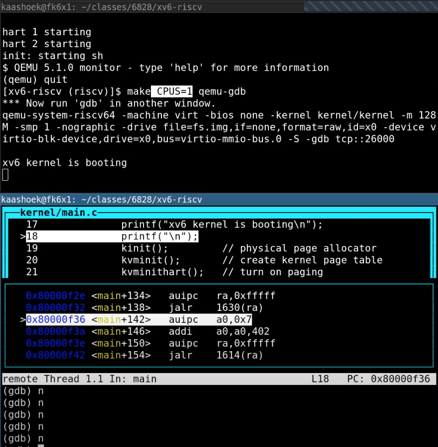

除了console之外，还有许多代码来做初始化。

- kinit：设置好页表分配器（page allocator）
- kvminit：设置好虚拟内存，这是下节课的内容
- kvminithart：打开页表，也是下节课的内容
- processinit：设置好初始进程或者说设置好进程表单
- trapinit/trapinithart：设置好user/kernel mode转换代码
- plicinit/plicinithart：设置好中断控制器PLIC（Platform Level Interrupt Controller），我们后面在介绍中断的时候会详细的介绍这部分，这是我们用来与磁盘和console交互方式
- binit：分配buffer cache
- iinit：初始化inode缓存
- fileinit：初始化文件系统
- virtio_disk_init：初始化磁盘
- userinit：最后当所有的设置都完成了，操作系统也运行起来了，会通过userinit运行第一个进程，这里有点意思，接下来我们看一下userinit

可以通过gdb的s指令，跳到userinit内部。

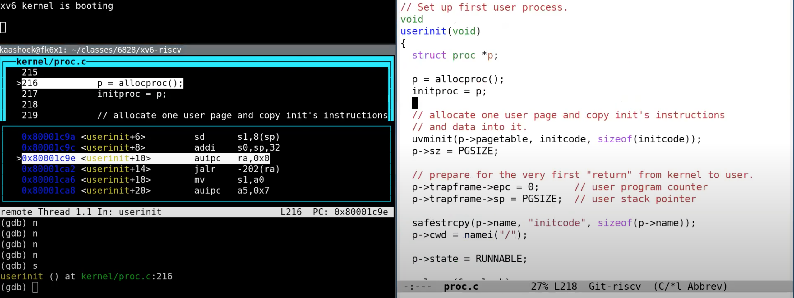

上图是userinit函数，右边是源码，左边是gdb视图。userinit有点像是胶水代码/Glue code（胶水代码不实现具体的功能，只是为了适配不同的部分而存在），它利用了XV6的特性，并启动了第一个进程。我们总是需要有一个用户进程在运行，这样才能实现与操作系统的交互，所以这里需要一个小程序来初始化第一个用户进程。这个小程序定义在initcode中。

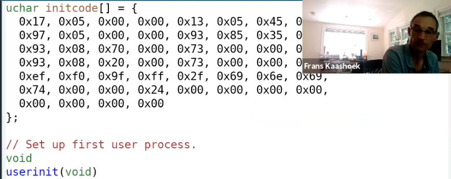

这里直接是程序的二进制形式，它会链接或者在内核中直接静态定义。实际上，这段代码对应了下面的汇编程序。

这个汇编程序中，它首先将init中的地址加载到a0（la a0, init），argv中的地址加载到a1（la a1, argv），exec系统调用对应的数字加载到a7（li a7, SYS_exec），最后调用ECALL。所以这里执行了3条指令，之后在第4条指令将控制权交给了操作系统。

如果我在syscall中设置一个断点，

我们可以查看syscall的代码，

*num = p->trapframe->a7* 会读取使用的系统调用对应的整数。当代码执行完这一行之后，我们可以在gdb中打印num，可以看到是7。

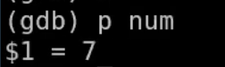

如果我们查看syscall.h，可以看到7对应的是exec系统调用。

所以，这里本质上是告诉内核，某个用户应用程序执行了ECALL指令，并且想要调用exec系统调用。

*p->trapframe->a0 = syscall[num]()* 这一行是实际执行系统调用。这里可以看出，num用来索引一个数组，这个数组是一个函数指针数组，可以预期的是syscall[7]对应了exec的入口函数。我们跳到这个函数中去，可以看到，我们现在在sys_exec函数中。

sys_exec中的第一件事情是从用户空间读取参数，它会读取path，也就是要执行程序的文件名。这里首先会为参数分配空间，然后从用户空间将参数拷贝到内核空间。之后我们打印path，

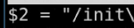

可以看到传入的就是init程序。所以，综合来看，initcode完成了通过exec调用init程序。让我们来看看init程序，

init会为用户空间设置好一些东西，比如配置好console，调用fork，并在fork出的子进程中执行shell。

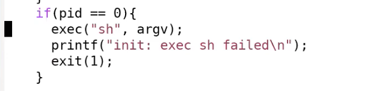

最终的效果就是Shell运行起来了。如果我再次运行代码，我还会陷入到syscall中的断点，并且同样也是调用exec系统调用，只是这次是通过exec运行Shell。当Shell运行起来之后，我们可以从QEMU看到Shell。

这里简单的介绍了一下XV6是如何从0开始直到第一个Shell程序运行起来。并且我们也看了一下第一个系统调用是在什么时候发生的。我们并没有看系统调用背后的具体机制，这个在后面会介绍。但是目前来说，这些对于你们完成这周的syscall lab是足够了。

