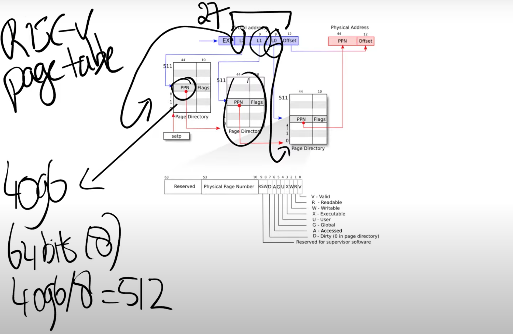
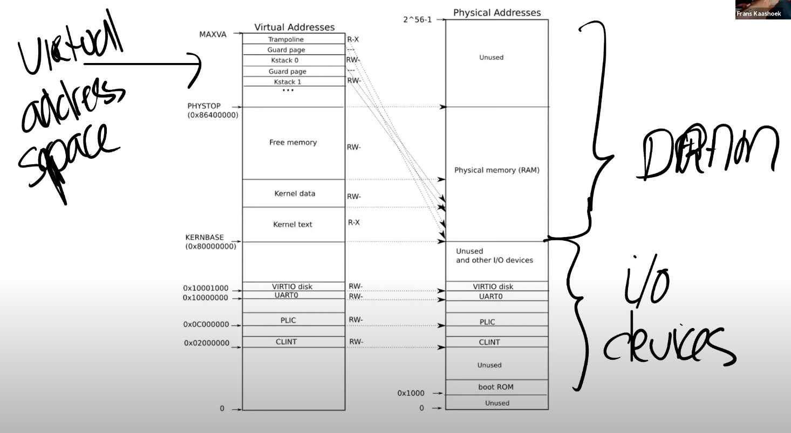
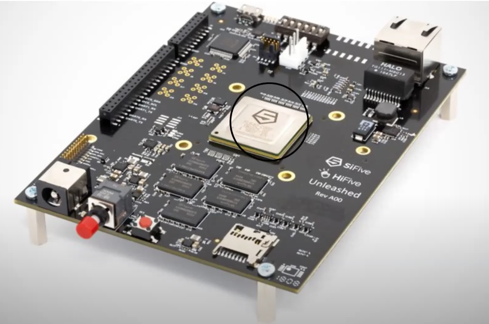
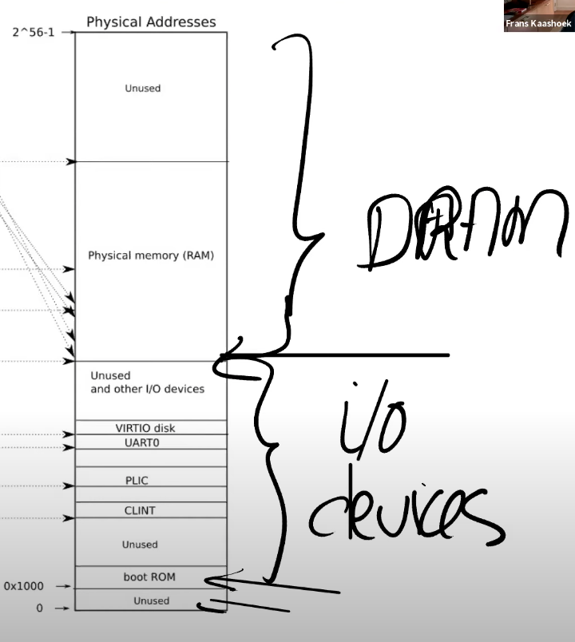
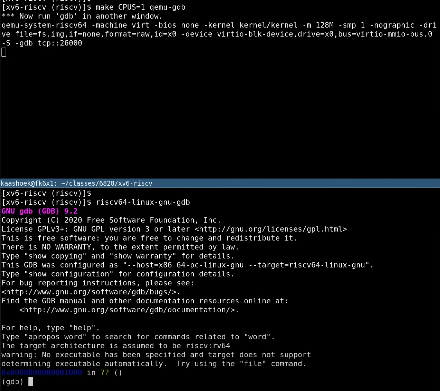
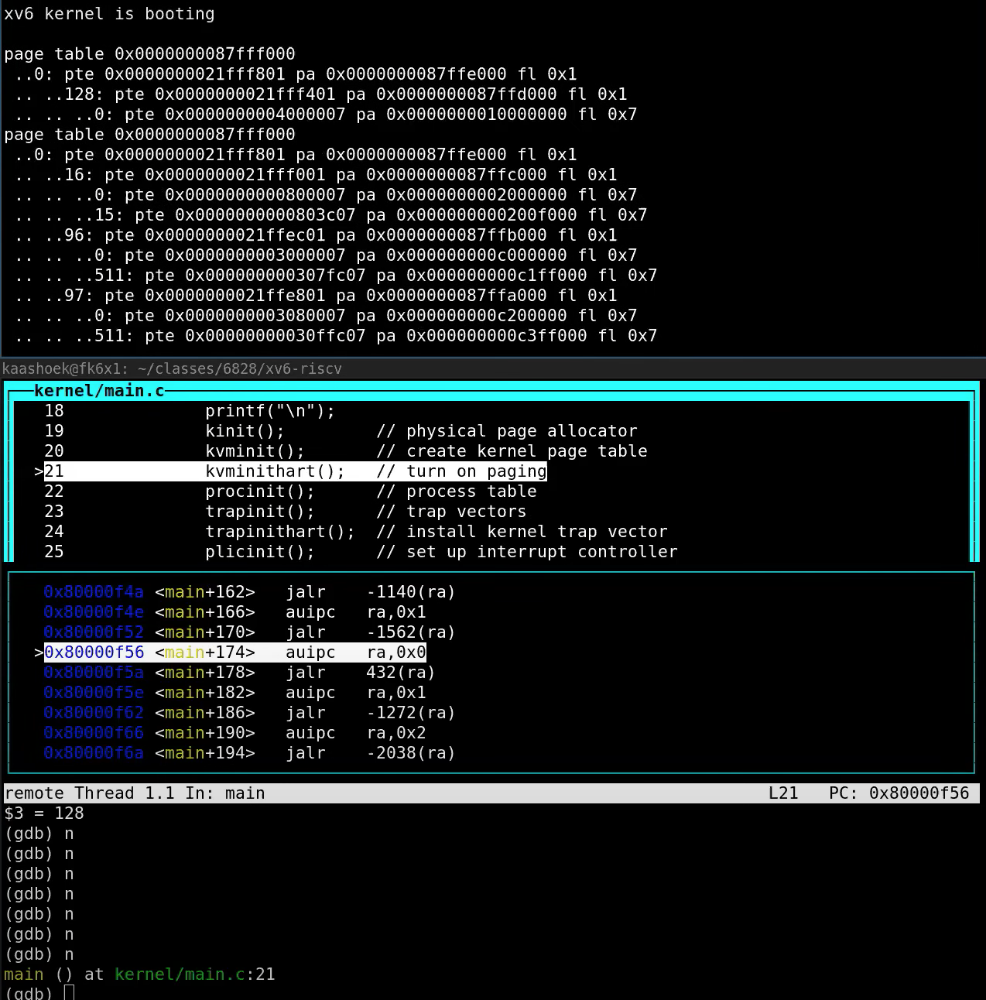
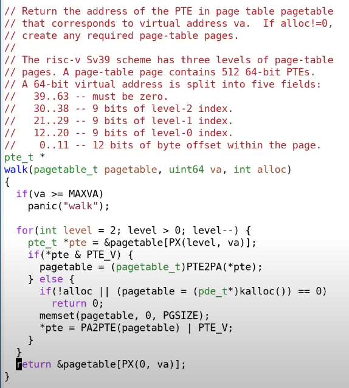
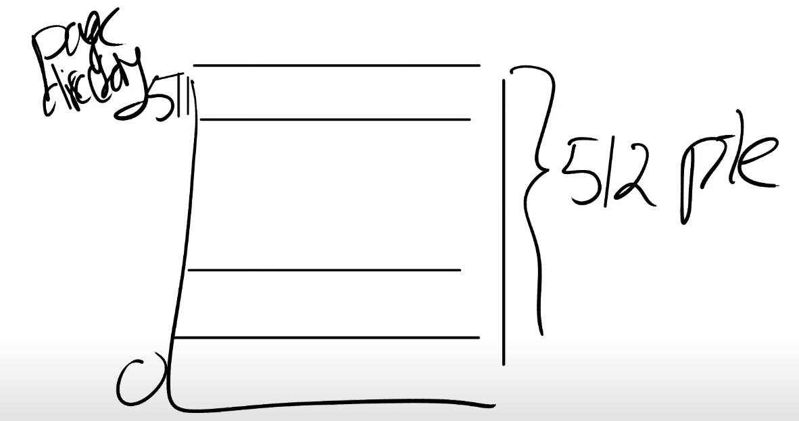
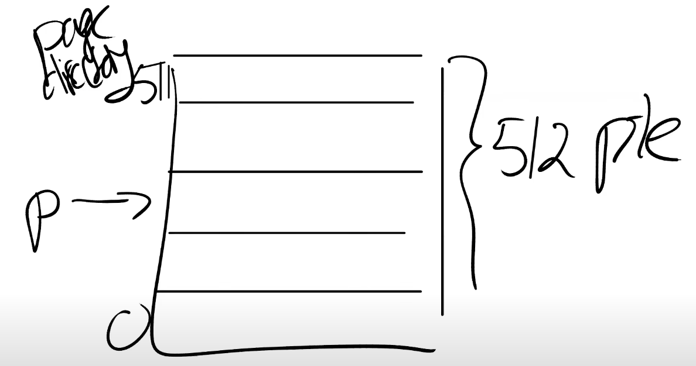

# 课程内容简介

今天的内容主要是3个部分：

1.首先我会讨论一下地址空间（Address Spaces）。

2.接下来，我会谈一下支持虚拟内存的硬件。当然，我介绍的是RISC-V相关的硬件。但是从根本上来说，所有的现代处理器都有某种形式的硬件，来作为实现虚拟内存的默认机制。

3.最后，我们会过一下XV6中的虚拟内存代码，并看一下内核地址空间和用户地址空间的结构。

# 地址空间（Address Spaces）

在课程最开始的回答中，很多同学都提到了，创造虚拟内存的一个出发点是你可以通过它实现**隔离性**。如果你正确的设置了page table，并且通过代码对它进行正确的管理，那么原则上你可以实现强隔离。所以，我们先来回顾一下，我们期望从隔离性中得到什么样的效果。

在我们一个常出现的图中，我们有一些用户应用程序比如说Shell，cat以及你们自己在lab1创造的各种工具。在这些应用程序下面，我们有操作系统位于内核空间。

我们期望的是，**每个用户程序都被装进一个盒子里**，这样它们就不会彼此影响了。类似的，我们也想让它们与内核操作系统相互独立，这样如果某个应用程序无意或者故意做了一些坏事，也不会影响到操作系统。这是我们对于隔离性的期望。

今天的课程中，我们想关注的是**内存的隔离性**。如果我们不做任何工作，默认情况下我们是没有内存隔离性的。你们可以回想一下，在我们上节课展示的RISC-V主板上，内存是由一些DRAM芯片组成。在这些DRAM芯片中保存了程序的数据和代码。例如内存中的某一个部分是内核，包括了文本，数据，栈等等；如果运行了Shell，内存中的某个部分就是Shell；如果运行了cat程序，内存中的某个部分是cat程序。这里说的都是物理内存，它的地址从0开始到某个大的地址结束。结束地址取决于我们的机器现在究竟有多少物理内存。**所有程序都必须存在于物理内存中**，否则处理器甚至都不能处理程序的指令。

这里的风险很明显。我们简单化一下场景，假设Shell存在于内存地址1000-2000之间。

如果cat出现了程序错误，将内存地址1000，也就是Shell的起始地址加载到寄存器a0中。之后执行\*sd $7, (a0)*，这里等效于将7写入内存地址1000。

现在**cat程序弄乱了Shell程序的内存镜像，所以隔离性被破坏了**，这是我们不想看到的现象。所以，我们想要某种机制，能够将不同程序之间的内存隔离开来，这样类似的事情就不会发生。一种实现方式是**地址空间**（Address Spaces）。

这里的基本概念也很简单直观，我们给包括**内核在内的所有程序专属的地址空间**。所以，当我们运行cat时，它的地址空间从0到某个地址结束。当我们运行Shell时，它的地址也从0开始到某个地址结束。内核的地址空间也从0开始到某个地址结束。

如果cat程序想要向地址1000写入数据，那么cat只会向它自己的地址1000，而不是Shell的地址1000写入数据。所以，基本上来说，**每个程序都运行在自己的地址空间，并且这些地址空间彼此之间相互独立**。在这种不同地址空间的概念中，cat程序甚至都不具备引用属于Shell的内存地址的能力。这是我们想要达成的终极目标，因为这种方式为我们提供了强隔离性，cat现在不能引用任何不属于自己的内存。

所以现在我们的问题是如何在一个物理内存上，创建不同的地址空间，因为归根到底，我们使用的还是一堆存放了内存信息的DRAM芯片。

# 页表（Page Table）

我们如何能够实现地址空间呢？或者说如何在一个物理内存上，创建不同的地址空间？

最常见的方法，同时也是非常灵活的一种方法就是使用页表（Page Tables）。页表是在硬件中通过处理器和内存管理单元（Memory Management Unit）实现。所以，在你们的脑海中，应该有这么一张图：CPU正在执行指令，例如*sd $7, (a0)。*

对于任何一条带有地址的指令，其中的地址应该认为是虚拟内存地址而不是物理地址。假设寄存器a0中是地址0x1000，那么这是一个虚拟内存地址。虚拟内存地址会被转到内存管理单元（MMU，Memory Management Unit），内存管理单元会将虚拟地址翻译成物理地址。之后这个物理地址会被用来索引物理内存，并从物理内存加载，或者向物理内存存储数据。

从CPU的角度来说，一旦MMU打开了，它执行的每条指令中的地址都是虚拟内存地址。

为了能够完成虚拟内存地址到物理内存地址的翻译，MMU会有一个**表单，表单中，一边是虚拟内存地址，另一边是物理内存地址**。举个例子，虚拟内存地址0x1000对应了一个我随口说的物理内存地址0xFFF0。这样的表单可以非常灵活。

通常来说，内存地址对应关系的**表单也保存在内存**中。所以CPU中**需要有一些寄存器用来存放表单在物理内存中的地址**。现在，在内存的某个位置保存了地址关系表单，我们假设这个位置的物理内存地址是0x10。那么在RISC-V上一个叫做SATP的寄存器会保存地址0x10。这样，CPU就可以告诉MMU，可以从哪找到将虚拟内存地址翻译成物理内存地址的表单。

这里的基本想法是**每个应用程序都有自己独立的表单**，并且这个表单定义了应用程序的地址空间。所以当操作系统将CPU从一个应用程序切换到另一个应用程序时，同时也需要**切换SATP寄存器中的内容**，从而指向新的进程保存在物理内存中的地址对应表单。这样的话，cat程序和Shell程序中相同的虚拟内存地址，就可以翻译到不同的物理内存地址，因为每个应用程序都有属于自己的不同的地址对应表单。

接下来我将分两步介绍RISC-V中是如何工作的。

第一步：不要为每个地址创建一条表单条目，而是**为每个page创建一条表单条目**，所以每一次地址翻译都是针对一个page。而RISC-V中，一个page是4KB，也就是4096Bytes。这个大小非常常见，几乎所有的处理器都使用4KB大小的page或者支持4KB大小的page。

现在，内存地址的翻译方式略微的不同了。首先对于虚拟内存地址，我们将它划分为两个部分，index和offset，index用来查找page，offset对应的是一个page中的哪个字节。

当MMU在做地址翻译的时候，通过读取虚拟内存地址中的index可以知道物理内存中的page号，这个page号对应了物理内存中的4096个字节。之后虚拟内存地址中的offset指向了page中的4096个字节中的某一个，假设offset是12，那么page中的第12个字节被使用了。**将offset加上page的起始地址，就可以得到物理内存地址**。

有关RISC-V的一件有意思的事情是，虚拟内存地址都是64bit，这也说的通，因为RISC-V的寄存器是64bit的。但是实际上，在我们使用的RSIC-V处理器上，并不是所有的64bit都被使用了，也就是说高25bit并没有被使用。这样的结果是限制了虚拟内存地址的数量，虚拟内存地址的数量现在只有2^39个，大概是512GB。当然，如果必要的话，最新的处理器或许可以支持更大的地址空间，只需要将未使用的25bit拿出来做为虚拟内存地址的一部分即可。

在剩下的39bit中，**有27bit被用来当做index，12bit被用来当做offset**。offset必须是12bit，因为对应了一个page的4096个字节。

在RISC-V中，物理内存地址是56bit。所以物理内存可以大于单个虚拟内存地址空间，但是也最多到$2^{56}$。大多数主板还不支持$2^{56}$这么大的物理内存，但是原则上，如果你能造出这样的主板，那么最多可以支持2^56字节的物理内存。

物理内存地址是56bit，其中44bit是物理page号（PPN，Physical Page Number），剩下12bit是offset完全继承自虚拟内存地址（也就是地址转换时，只需要将虚拟内存中的27bit翻译成物理内存中的44bit的page号，剩下的12bitoffset直接拷贝过来即可）。(如果虚拟内存最多是2^27 （最多应该是2^39 ），而物理内存最多是2^56，这样我们可以有多个进程都用光了他们的虚拟内存，但是物理内存还有剩余。)

通过前面的第一步，我们现在是的地址转换表是**以page为粒度**，而不是以单个内存地址为粒度，现在这个地址转换表已经可以被称为page table了。但是目前的设计还不能满足实际的需求。

如果每个进程都有自己的page table，那么每个page table表会有多大呢？这个page table最多会有2^27个条目（虚拟内存地址中的index长度为27），这是个非常大的数字。如果**每个进程都使用这么大的page table，进程需要为page table消耗大量的内存，并且很快物理内存就会耗尽。**

所以实际上，硬件并不是按照这里的方式来存储page table。从概念上来说，你可以认为page table是从0到2^27，但是实际上并不是这样。实际中，page table是一个多级的结构。下图是一个真正的RISC-V page table结构和硬件实现。

我们之前提到的虚拟内存地址中的27bit的index，实际上是由3个9bit的数字组成（L2，L1，L0）。前9个bit被用来索引最高级的page directory（注：通常page directory是用来索引page table或者其他page directory物理地址的表单，但是在课程中，page table，page directory， page directory table区分并不明显，可以都认为是有相同结构的地址对应表单）。

一个directory是4096Bytes，**就跟page的大小是一样的**。Directory中的一个条目被称为PTE（Page Table Entry）是64bits，就像寄存器的大小一样，也就是8Bytes。所以一个Directory page有512个条目。

所以实际上，SATP寄存器会指向最高一级的page directory的物理内存地址，之后我们用虚拟内存中index的高9bit用来索引最高一级的page directory，这样我们就能得到一个PPN，也就是物理page号。这个PPN指向了中间级的page directory。

当我们在使用中间级的page directory时，我们通过虚拟内存地址中的L1部分完成索引。接下来会走到最低级的page directory，我们通过虚拟内存地址中的L0部分完成索引。在最低级的page directory中，我们可以得到对应于虚拟内存地址的物理内存地址。

从某种程度上来说，与之前一种方案还是很相似的，除了实际的索引是由3步，而不是1步完成。这种方式的主要优点是，如果地址空间中大部分地址都没有使用，你不必为每一个index准备一个条目。举个例子，如果你的地址空间只使用了一个page，4096Bytes。除此之外，你没有使用任何其他的地址。现在，你需要多少个page table entry，或者page table directory来映射这一个page？

在最高级，你需要一个page directory。在这个page directory中，你需要一个数字是0的PTE，指向中间级page directory。所以在中间级，你也需要一个page directory，里面也是一个数字0的PTE，指向最低级page directory。所以这里总共需要3个page directory（也就是3 * 512个条目）。

而在前一个方案中，虽然我们只使用了一个page，还是需要2^27个PTE。这个方案中，我们只需要3 * 512个PTE。所需的空间大大减少了。这是实际上硬件采用这种层次化的3级page directory结构的主要原因。

接下来，让我们看看PTE中的Flag，因为它也很重要。每个PTE的低10bit是一堆标志位：

- 第一个标志位是Valid。如果Valid bit位为1，那么表明这是一条合法的PTE，你可以用它来做地址翻译。对于刚刚举得那个小例子（应用程序只用了1个page的例子），我们只使用了3个page directory，每个page directory中只有第0个PTE被使用了，所以只有第0个PTE的Valid bit位会被设置成1，其他的511个PTE的Valid bit为0。这个标志位告诉MMU，你不能使用这条PTE，因为这条PTE并不包含有用的信息。
- 下两个标志位分别是Readable和Writable。表明你是否可以读/写这个page。
- Executable表明你可以从这个page执行指令。
- User表明这个page可以被运行在用户空间的进程访问。
- 其他标志位并不是那么重要，他们偶尔会出现，前面5个是重要的标志位。

学生提问：我想知道我们是怎么计算page table的物理地址，是不是这样，我们从最高级的page table得到44bit的PPN，然后再加上虚拟地址中的12bit offset，就得到了完整的56bit page table物理地址？

Frans教授：我们不会加上虚拟地址中的offset，这里只是使用了12bit的0。所以我们用44bit的PPN，再加上12bit的0，这样就得到了下一级page directory的56bit物理地址。这里要求每个page directory都与物理page对齐（也就是page directory的起始地址就是某个page的起始地址，所以低12bit都为0）。

# 页表缓存（Translation Lookaside Buffer）

如果我们回想一下page table的结构，你可以发现，当处理器从内存加载或者存储数据时，基本上都要做3次内存查找，第一次在最高级的page directory，第二次在中间级的page directory，最后一次在最低级的page directory。所以对于一个虚拟内存地址的寻址，需要读三次内存，这里代价有点高。所以实际中，几乎所有的处理器都会对于最近使用过的虚拟地址的翻译结果有缓存。这个缓存被称为：Translation Lookside Buffer（通常翻译成页表缓存）。你会经常看到它的缩写TLB。基本上来说，这就是Page Table Entry的缓存，也就是PTE的缓存。

当处理器第一次查找一个虚拟地址时，硬件通过3级page table得到最终的PPN，TLB会保存虚拟地址到物理地址的映射关系。这样下一次当你访问同一个虚拟地址时，处理器可以查看TLB，TLB会直接返回物理地址，而不需要通过page table得到结果。

学生提问：之前提到，硬件会完成3级 page table的查找，那为什么我们要在XV6中有一个walk函数来完成同样的工作？

Frans教授：非常好的问题。这里有几个原因，首先XV6中的walk函数设置了最初的page table，它需要对3级page table进行编程所以它首先需要能模拟3级page table。另一个原因或许你们已经在syscall实验中遇到了，在XV6中，内核有它自己的page table，用户进程也有自己的page table，用户进程指向sys_info结构体的指针存在于用户空间的page table，但是内核需要将这个指针翻译成一个自己可以读写的物理地址。如果你查看copy_in，copy_out，你可以发现内**核会通过用户进程的page table，将用户的虚拟地址翻译得到物理地址，这样内核可以读写相应的物理内存地址**。这就是为什么在XV6中需要有walk函数的一些原因。

# Kernel Page Table

接下来，我们看一下在XV6中，page table是如何工作的？首先我们来看一下kernel page的分布。下图就是内核中地址的对应关系，左边是内核的虚拟地址空间，右边上半部分是物理内存或者说是DRAM，右边下半部分是I/O设备。接下来我会首先介绍右半部分，然后再介绍左半部分。

图中的右半部分的结构完全由硬件设计者决定。如你们上节课看到的一样，当操作系统启动时，会从地址0x80000000开始运行，这个地址其实也是由硬件设计者决定的。具体的来说，如果你们看一个主板，

中间是RISC-V处理器，我们现在知道了处理器中有4个核，每个核都有自己的MMU和TLB。处理器旁边就是DRAM芯片。

主板的设计人员决定了，在完成了虚拟到物理地址的翻译之后，如果得到的物理地址大于0x80000000会走向DRAM芯片，如果得到的物理地址低于0x80000000会走向不同的I/O设备。这是由这个主板的设计人员决定的物理结构。如果你想要查看这里的物理结构，你可以阅读主板的手册，手册中会一一介绍物理地址对应关系。

首先，地址0是保留的，地址0x10090000对应以太网，地址0x80000000对应DDR内存，处理器外的易失存储（Off-Chip Volatile Memory），也就是主板上的DRAM芯片。所以，在你们的脑海里应该要记住这张主板的图片，即使我们接下来会基于你们都知道的C语言程序---QEMU来做介绍，但是最终所有的事情都是由主板硬件决定的。

回到最初那张图的右侧：物理地址的分布。可以看到最下面是未被使用的地址，这与主板文档内容是一致的（地址为0）。地址0x1000是boot ROM的物理地址，当你对主板上电，主板做的第一件事情就是运行存储在boot ROM中的代码，当boot完成之后，会跳转到地址0x80000000，操作系统需要确保那个地址有一些数据能够接着启动操作系统。

这里还有一些其他的I/O设备：

- PLIC是中断控制器（Platform-Level Interrupt Controller）我们下周的课会讲。
- CLINT（Core Local Interruptor）也是中断的一部分。所以多个设备都能产生中断，需要中断控制器来将这些中断路由到合适的处理函数。
- UART0（Universal Asynchronous Receiver/Transmitter）负责与Console和显示器交互。
- VIRTIO disk，与磁盘进行交互。

地址0x02000000对应CLINT，当你向这个地址执行读写指令，你是向实现了CLINT的芯片执行读写。**这里你可以认为你直接在与设备交互，而不是读写物理内存。**

接下来我会切换到第一张图的左边，这就是XV6的虚拟内存地址空间。当机器刚刚启动时，还没有可用的page，XV6操作系统会设置好内核使用的虚拟地址空间，也就是这张图左边的地址分布。

因为我们想让XV6尽可能的简单易懂，所以这里的虚拟地址到物理地址的映射，大部分是相等的关系。比如说内核会按照这种方式设置page table，虚拟地址0x02000000对应物理地址0x02000000。这意味着左侧低于PHYSTOP的虚拟地址，与右侧使用的物理地址是一样的。

所以，这里的箭头都是水平的，因为这里是完全相等的映射。

除此之外，这里还有两件重要的事情：

第一件事情是，有一些page在虚拟内存中的地址很靠后，比如kernel stack在虚拟内存中的地址就很靠后。这是因为在它之下有一个未被映射的Guard page，这个Guard page对应的PTE的Valid 标志位没有设置，这样，如果kernel stack耗尽了，它会溢出到Guard page，但是因为Guard page的PTE中Valid标志位未设置，会导致立即触发page fault，这样的结果好过内存越界之后造成的数据混乱。立即触发一个panic（也就是page fault），你就知道kernel stack出错了。同时我们也又不想浪费物理内存给Guard page，所以Guard page不会映射到任何物理内存，它只是占据了虚拟地址空间的一段靠后的地址。

同时，kernel stack被映射了两次，在靠后的虚拟地址映射了一次，在PHYSTOP下的Kernel data中又映射了一次，但是实际使用的时候用的是上面的部分，因为有Guard page会更加安全。这是众多你可以通过page table实现的有意思的事情之一。你可以向同一个物理地址映射两个虚拟地址，你可以不将一个虚拟地址映射到物理地址。可以是一对一的映射，一对多映射，多对一映射。XV6至少在1-2个地方用到类似的技巧。这的kernel stack和Guard page就是XV6基于page table使用的有趣技巧的一个例子。

第二件事情是权限。例如Kernel text page被标位R-X，意味着你可以读它，也可以在这个地址段执行指令，但是你不能向Kernel text写数据。通过设置权限我们可以尽早的发现Bug从而避免Bug。对于Kernel data需要能被写入，所以它的标志位是RW-，但是你不能在这个地址段运行指令，所以它的X标志位未被设置。（注，所以，kernel text用来存代码，代码可以读，可以运行，但是不能篡改，kernel data用来存数据，数据可以读写，但是不能通过数据伪装代码在kernel中运行）

# kvminit 函数

接下来，让我们看一看代码，我认为很多东西都会因此变得更加清晰。

首先，我们来做一个的常规操作，启动我们的XV6，这里QEMU实现了主板，同时我们打开gdb。

上一次我们看了boot的流程，我们跟到了main函数。main函数中调用的一个函数是kvminit（3.9），这个函数会设置好kernel的地址空间。kvminit的代码如下图所示：

我们在前一部分看了kernel的地址空间长成什么样，这里我们来看一下代码是如何将它设置好的。首先在kvminit中设置一个断点，之后运行代码到断点位置。在gdb中执行layout split，可以看到（从上面的代码也可以看出）函数的第一步是为最高一级page directory分配物理page（注，调用kalloc就是分配物理page）。下一行将这段内存初始化为0。

之后，通过kvmmap函数，将每一个I/O设备映射到内核。例如，下图中高亮的行将UART0映射到内核的地址空间。

我们可以查看一个文件叫做memlayout.h，它将4.5中的文档翻译成了一堆常量。在这个文件里面可以看到，UART0对应了地址0x10000000（注，4.5中的文档是真正SiFive RISC-V的文档，而下图是QEMU的地址，所以4.5中的文档地址与这里的不符）。

所以，通过kvmmap可以将物理地址映射到相同的虚拟地址（注，因为kvmmap的前两个参数一致）。

在page table实验中，第一个练习是实现vmprint，这个函数会打印当前的kernel page table。我们现在跳过这个函数，看一下执行完第一个kvmmap时的kernel page table。

我们来看一下这里的输出。第一行是最高一级page directory的地址，这就是存在SATP或者将会存在SATP中的地址。第二行可以看到最高一级page directory只有一条PTE序号为0，它包含了中间级page directory的物理地址。第三行可以看到中间级的page directory只有一条PTE序号为128，它指向了最低级page directory的物理地址。第四行可以看到最低级的page directory包含了PTE指向物理地址。你们可以看到最低一级 page directory中PTE的物理地址就是0x10000000，对应了UART0。

前面是物理地址，我们可以从虚拟地址的角度来验证这里符合预期。我们将地址0x10000000向右移位12bit，这样可以得到虚拟地址的高27bit（index部分）。之后我们再对这部分右移位9bit，并打印成10进制数，可以得到128，这就是中间级page directory中PTE的序号。这与之前（4.4）介绍的内容是符合的。

从标志位来看（fl部分），最低一级page directory中的PTE有读写标志位，并且Valid标志位也设置了（4.3底部有标志位的介绍）。

内核会持续的按照这种方式，调用kvmmap来设置地址空间。之后会对VIRTIO0、CLINT、PLIC、kernel text、kernel data、最后是TRAMPOLINE进行地址映射。最后我们还会调用vmprint打印完整的kernel page directory，可以看出已经设置了很多PTE。

这里就不过细节了，但是这些PTE构成了我们在4.5中看到的地址空间对应关系。

# kvminithart 函数

之后，kvminit函数返回了，在main函数中，我们运行到了kvminithart函数。

这个函数首先设置了SATP寄存器，kernel_pagetable变量来自于kvminit第一行。**所以这里实际上是内核告诉MMU来使用刚刚设置好的page table**。当这里这条指令执行之后，下一个指令的地址会发生什么？

在这条指令之前，还不存在可用的page table，所以也就不存在地址翻译。执行完这条指令之后，程序计数器（Program Counter）增加了4。而之后的下一条指令被执行时，程序计数器会被内存中的page table翻译。

所以这条指令的执行时刻是一个非常重要的时刻。因为整个地址翻译从这条指令之后开始生效，之后的每一个使用的内存地址都可能对应到与之不同的物理内存地址。**因为在这条指令之前，我们使用的都是物理内存地址，这条指令之后page table开始生效，所有的内存地址都变成了另一个含义，也就是虚拟内存地址。**

这里能正常工作的原因是值得注意的。因为前一条指令还是在物理内存中，而后一条指令已经在虚拟内存中了。比如，下一条指令地址是0x80001110就是一个虚拟内存地址。

为什么这里能正常工作呢？因为kernel page的映射关系中，虚拟地址到物理地址是完全相等的。所以，在我们打开虚拟地址翻译硬件之后，地址翻译硬件会将一个虚拟地址翻译到相同的物理地址。所以实际上，我们最终还是能通过内存地址执行到正确的指令，因为经过地址翻译0x80001110还是对应0x80001110。

管理虚拟内存的一个难点是，一旦执行了类似于SATP这样的指令，你相当于将一个page table加载到了SATP寄存器，你的世界完全改变了。现在每一个地址都会被你设置好的page table所翻译。那么假设你的page table设置错误了，会发生什么呢？有人想回答这个问题吗？

是的，**因为page table没有设置好，虚拟地址可能根本就翻译不了**，那么内核会停止运行并panic。所以，如果page table中有bug，你将会看到奇怪的错误和崩溃，这导致了page table实验将会比较难。如果你不够小心，或者你没有完全理解一些细节，你可能会导致kernel崩溃，这将会花费一些时间和精力来追踪背后的原因。但这就是管理虚拟内存的一部分，因为对于一个这么强大的工具，如果出错了，相应的你也会得到严重的后果。我并不是要给你们泼凉水，哈哈。另一方面，这也很有乐趣，经过了page table实验，你们会真正理解虚拟内存是什么，虚拟内存能做什么。

# walk 函数

这个函数会返回page table的PTE，而内核可以读写PTE。我来画个图，首先我们有一个page directory，这个page directory 有512个PTE。最下面是0，最上面是511。

这个函数的作用是返回某一个PTE的指针。

这是个虚拟地址，它指向了这个PTE。之后内核可以通过向这个地址写数据来操纵这条PTE执行的物理page。当page table被加载到SATP寄存器，这里的更改就会生效。

从代码看，这个函数从level2走到level1然后到level0，如果参数alloc不为0，且某一个level的page table不存在，这个函数会创建一个临时的page table，将内容初始化为0，并继续运行。所以最后总是返回的是最低一级的page directory的PTE。

如果参数alloc没有设置，那么在第一个PTE对应的下一级page table不存在时就会返回。

